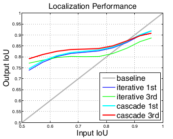
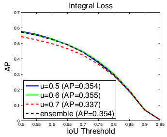
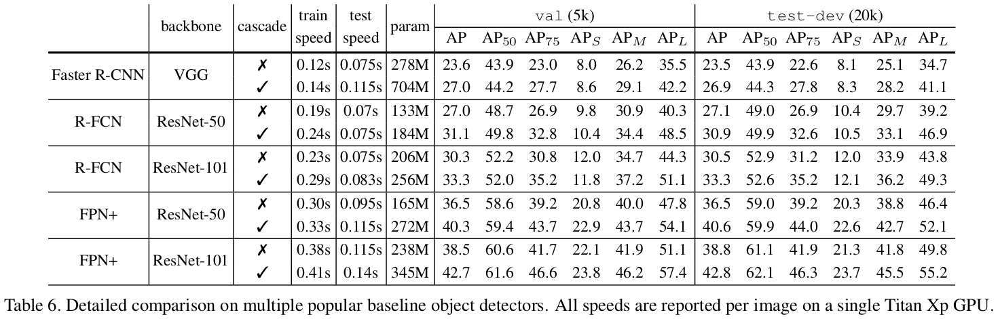
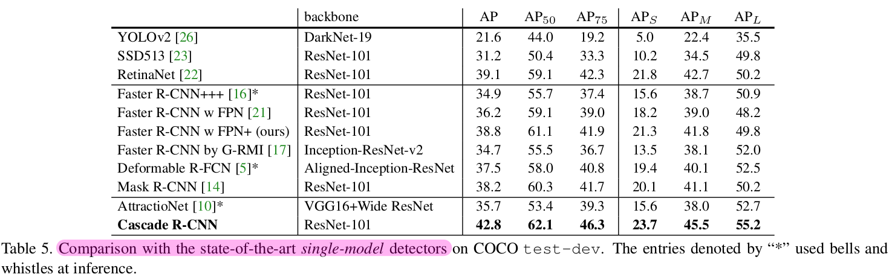

# [paper reading] Cascade R-CNN

|                   topic                    |                          motivation                          |                          technique                           |                         key element                          |                             math                             |                  use yourself                   |
| :----------------------------------------: | :----------------------------------------------------------: | :----------------------------------------------------------: | :----------------------------------------------------------: | :----------------------------------------------------------: | :---------------------------------------------: |
| [Cascade R-CNN](./[paper reading] FCOS.md) | [Problem to Solve](#Problem to Solve) [Motivation](#Motivation) | [Architecture](#Architecture) [Advantages](#Advantages) | [Degradation of High IoU](#Degradation of High IoU) [Quality Match](#Quality Match) [Cascade Regression](#Cascade Regression) [Cascade Detection](#Cascade Detection) [Iterative BB Regression](#Iterative BB Regression) [Integral Loss](#Integral Loss) [Training Strategy](#Training Strategy) [Inference Strategy](#Inference Strategy) [implement Details](#implement Details) [Generalization Capacity](#Generalization Capacity) [Ablation Experiments](#Ablation Experiments) [Comparison with SOTA](#Comparison with SOTA) | [Loss Function of Stages](#Loss Function of Stages) [Standard BBox Regression](#Standard BBox Regression) [Iterative BB Regression](#Iterative BB Regression) [Classification](#Classification) | [Thought & Inspiration](#Thought & Inspiration) |

## Motivations

>   有2个概念容易混淆：
>
>   -   **Training IoU Threshold**
>
>       在**训练时**用于判定**proposal**为**positive / negative**，等同于**detector quality**
>
>   -   **Inference IoU Threshold**
>
>       在推断时用于判定**object**为**successful /missed**，用于计算**AP**等**metric**
>
>       （即图中的横坐标IoU Threshold）

### Problem to Solve

通过IoU Threshold判定positive & negative
$$
y=\left\{\begin{array}{cl}
g_{y}, & \operatorname{IoU}(x, g) \geq u \\
0, & \text { otherwise }
\end{array}\right.
$$
以单个**IoU Threshold**来判定**positive / negative**有以下的优点和缺点：

#### **Low IoU Threshold** (e.g. **0.5**) 

-   **Advantage**：

    可以获得 **rich & diversified** 的 **training sample**（当然需要配合着**Resample Strategy**）

-   **Drawback**：

    IoU=0.5对于**positive的要求过于宽松**，会频繁产生**noisy bounding box** (e.g. **close false negative**)，使得由此训练得到的**detector难以在inference时拒绝close false positive**

    >   **close false negative： close but not correct** 

    

    在**inference**时，**detector产生的hypothesis的质量较低**，所以需要**detector**对**低质量的hypothesis有更强的分辨能力**，所以选择 **u=0.5** 是一个**trade-off**

#### **High IoU Threshold**

-   **Advantage**：

    在**训练样本**中包含的**背景更少**

-   **Drawback**：
    -   **High IoU Threshold**会导致用于**训练**的**positive**的数量**指数减少**

        

    -   **quality dismatch**：**detector性能最佳的IoU Threshold** (e.g. **training IoU Threshold**) ，和**inference时的hypothesis的IoU**不匹配

        简单来说：是**在High IoU Threshold下训练的detector，在inference时需要直面大量的Low IoU的proposal**

        

        

           (d) 中的 IoU Threshold 为在 inference 时被判定为success的阈值，用于计算 AP
        

        >   以经典的Faster R-CNN为例：
        >
        >   -   training阶段，RPN网络提出了2000左右的proposals，首先计算每个proposal和gt之间的**IoU**，通过人为的设定一个IoU阈值（通常为0.5），把这些**Proposals**分为**正样本（前景）和负样本（背景）**，并对这些**正负样本采样**，使得他们之间的比例尽量满足（1:3，二者总数量通常为128），之后这些proposals（128个）被送入到Roi Pooling，最后进行类别分类和box回归。
        >   -   inference阶段，RPN网络提出了300左右的proposals，这些proposals被送入到Fast R-CNN结构中，**和training阶段不同的是，inference阶段没有办法对这些proposals采样（inference阶段肯定不知道gt的，也就没法计算IoU）**，所以他们直接进入Roi Pooling，之后进行类别分类和box回归。

所以，简单来说，Cascade R-CNN要解决的问题有2个：

-   **overfitting** at **training**
-   **quality mismatch** at **inference**

### Motivation

**regressor**的**output IoU**总是**优于input IoU**

    三条曲线的output IoU均在baseline之上

即：以**特定IoU Threshold训练得到的detector**的**输出**，对于**训练higher IoU Threshold的detector**是**良好的distribution**

具体来说：通过**调整bounding box**，每个stage能找到**close false negative的良好集合**，来**训练下一个stage**

## Technique

### Architecture

#### Essence

**Cascade R-CNN**是**Cascade Regression**问题

#### Components

一系列训练使用**递增IoU**训练的detector，以对**close false negative**更有选择性

具体来说，是 **1 RPN stage (B0)** + **3 detection stage (H1、H2、H3， $\text{IoU} =\{0.5,0.6,0.7\}$)** 

-   **I**：**input image**

-   **conv**：**backbone**

-   **pool**：**region-wise feature extraction**

-   **H**：**network head**

-   **C**（**classification score**）

-   **B**（**bounding box**）

    **B0**为**proposal**

### Advantages

-   可以在不引入human engineering的基础上，获得more precise **localization**

-   易于应用，端到端训练，性能拔群
-   适配所有two-stage的RCNN框架
-   稳定涨点2%~4%（不论baseline）

## Key Elements

### Degradation of High IoU

**简单地提高Training IoU Threshold**，会导致**detector**发生**degradation**

   (d) 中的 IoU Threshold 为在 inference 时被判定为success的阈值，用于计算 AP

原因有2点：

-   **Hypothesis Distribution Imbalance**

    proposal detector生成的**hypothesis的distribution严重不平衡**，**low quality**占据**绝大部分**

    强行提高**Training IoU Threshold**，会使得**用于训练的正样本**呈**指数减少**，从而导致**过拟合**的问题

-   **Quality Mismatch**

    **Training IoU Threshold**和**hypothesis quality**的不匹配

    **high quality detector (e.g. high IoU threshold)** 只有对于**high quality hypothesis**才是**optimal**（否则是**suboptimal**）

    究其原因：以**high IoU Threshold训练detector**，会使detector**只能对于high quality hypothesis有表现良好**。而在**inference**时，由于**没有了IoU Threshold进行resample**，detector需要**直面大量的low quality hypothesis**

### Quality Match

#### Define of Quality

-   **Hypothesis Quality** (e.g. **Proposal Quality**，**IoU with ground truth**)
-   **Detector Quality** (e.g. **Training IoU Threshold** if **not degradation**)

#### Definition of Quality Match

**1个detector**只能在**1个hypothesis quality level**上为**optimal**

所以，要获得**高质量的detections**，需要在**detector quality**和**hypothesis quality**上建立**closer match**

   (d) 中的 IoU Threshold 为在 inference 时被判定为success的阈值，用于计算 AP

-   Figure (c)

    由于**over fitting**，**regressor**和**detector**对于**接近Training IoU Threshold**的样本表现最好

    （**input/output = 1**，即output IoU的增长不应低于input IoU的增长）

-   Figure (d)

    在**一个IoU level上最优的detector**，并**不会在其他IoU level上最优**（一般来说，**高质量的detector**需要**高质量的proposal**）

    IoU Threshold 为在 inference 时被判定为success的阈值，用于计算 AP

-   Figure (a)：AP $w.r.t.$ Training IoU Threshold

    -   实线：使用**自己的proposal**

        **IoU Threshold = 0.5** 对于**low quality proposal**的**鲁棒性更强**

    -   虚线：使用**Cascade R-CNN proposal**

        **Cascade R-CNN proposal**下，**Training IoU Threshold**越大，**提升**越大

-   Figure (b) ：AP $w.r.t.$ IoU Threshold（将**GT box加入到proposal**中）

    在将GT box加入proposal中后，**Training IoU Threshold = 0.7** 的detector提升最大，几乎在所有IoU level上表现良好

    -   **Training IoU Threshold = 0.5** 仅仅是对于low quality proposal鲁棒，并**不适合precise detection**
    -   **highly precise detection**需要**detector和hypothesis的quality**相**匹配**

### Cascade Regression

#### Essence

**Cascade Regression**本质上起到了**resample**的作用

即从**当前IoU distribution** $(x_i, \mathbf b_i)$ 中**resample**得到**higher IoU distribution** $(x_i', \mathbf b_i')$

#### Formulation

$$
f(x, \mathbf{b})=f_{T} \circ f_{T-1} \circ \cdots \circ f_{1}(x, \mathbf{b})
$$

即：对于**每个stage**，使用**不同的specialized regressor ($f_1 \cdots f_T$)**，使得**每个stage的regressor**对于**该stage的resampled distribution**均为**optimal**

#### Result

-   逐渐改善**hypothesis**的**quality**（一部分outlier会被剔除）

    

-   在**提升IoU**下，保持在**每个stage**中保证**positive sample相对固定的数量**（避免过拟合）

### Cascade Detection

**proposal sub-network**产生的**hypothesis质量很低**，导致**难以训练higher quality classifier**

而**Bounding Box Regressor**可以获得**higher IoU的bounding box**

通过**Cascade Regression的resample**，**hypothesis的quality逐步提升**，**higher quality detector**仅需要对**higher quality hypothesis**操作，从而实现**high quality detection**

-   每个detector在更**精确的hypothesis**下**均有提升**，且**detector质量 (e.g. Training IoU) 越高**，**提升越大**
-   **联合训练的detectors**比**单独训练的detector**性能更高（Figure 5 (a) $vs.$ Figure 6），即**Cascade R-CNN**可以**更好地训练detector**

### Iterative BB Regression

#### Formulation

详见 [Bounding Box Regression](#Bounding Box Regression)

#### Difference with Cascade Regression

-   作用不同
    -   **iterative BBox**是**post-processing**，用来提升**bounding box的quality**
    -   **Cascade Regression**是**resample**，用来改善**hypothesis**的分布
-   训练和推断的行为不同
    -   **Cascade Regression**在**training**和**inference**中具有**相同的行为**
-   optimal / suboptimal
    -   **iterative BBox**仅在**initial distribution**上为**optimal**
    -   **Cascade Regression**的**specialized regressor**在**各自stage的resampled distribution**上均为**optimal**

#### Drawback

-   需要**大量的手工设计**

-   提升并**不稳定**（一般来说2次之后就没有提升了）

    -   **Training IoU Threshold = 0.5的detector**对于**higher quality hypothesis**为**suboptimal**，甚至有**degradation**的危险
    -   在**迭代**中，**bounding box的distribution变化剧烈**，**regressor**仅仅在**initial distribution**为**optimal**，在之后为**suboptimal**

    

    -   Iterative BB Regression迭代使用3次 < Iterative BB Regression单次使用
    -   cascade R-CNN级联3个stage > cascade R-CNN单stage

#### Compared with Cascade R-CNN

### Integral Loss

一般来说，**单个classifier**很难**在所有的IoU level上表现良好**

#### Architecture

**Integral Loss**的思路是针对**不同的quality level**，使用**classifier的集合**

#### Drawback

-   不同的**loss**（**IoU Threshold**）对应的**positive的数量**不同

    尤其是**high IoU classifier**更容易**过拟合**

-   **inference**时，**low quality proposal**占主导，导致**high quality classifier**为**suboptimal**

-   **classifier**的**ensemble**没有**明显可见的提升**

    

#### Compared with Cascade R-CNN

### Training Strategy

**stage by stage**：**当前detector**输出**良好的分布**时，来训练**下一个higher quality detector** (e.g. **Higher IoU Threshold**)

原因：只有对progressively **improved hypothesis** (e.g. **proposals**) 进行**resample**，才能保证**每个stage的detector**都有几乎**数量相同的positive sample**，从而**避免过拟合**

### Inference Strategy

Inference和training**没有显著的差别**，二者都是使用**相同的Cascade Procedure**

**higher quality detector**仅仅对**higher quality hypothesis**进行操作，这使得**每个stage的hypothesis & detector quality** 有**closer match**

### implement Details

-   所有的**regressor**都是**class-agnostic**
-   **Cascade R-CNN**的**每个stage**都是相同的结构，即**baseline detection network的head**
-   **data augmentation**只使用**flip**
-   **single scale inference**，不使用**bells and whistle**

### Generalization Capacity

-   在各种baseline上稳定涨点2%~4%
-   参数量显性增加，运算量整体增加较小

### Ablation Experiments

#### Stage-wise Comparition

-   **stage-1**：已经**超过了baseline**，原因是**multi-stage multi-task learning**
-   **stage-2**：性能**显著提升**
-   **stage-3**：和stage-2**持平**
-   **former stage**在l**ow IoU metric (inference)** 上表现好，**later stage**在**high IoU metric (inference)** 上表现好，**集成之后性能最好**

#### IoU Threshold

    这里只看1、2行

-   First Row：

    **Cascade Improves** on the **baseline detector**

    **importance** of **optimizing stages** for the **corresponding sample distribution**

-   Second Row：

    **升高的Training IoU Threshold**可以使**detector**对**close false positive更有选择性**

#### Regression Statistics

    这里只看1、3行

以Figure 2的方式**删除outlier来更新统计数据**，有利于multi-task learning。但总的来说对此**并不敏感**

#### Number of Stages

-   **2个stage**的**提升幅度最大**
-   **4个及以上的stage**在**high Inference IoU Threshold上仍有提升**，但**整体下降**
-   **3个stage**是**最好的trade-off**

### Comparison with SOTA

## Math

### Loss Function of Stages

$$
L\left(x^{t}, g\right)=L_{c l s}\left(h_{t}\left(x^{t}\right), y^{t}\right)+\lambda\left[y^{t} \geq 1\right] L_{l o c}\left(f_{t}\left(x^{t}, \mathbf{b}^{t}\right), \mathbf{g}\right)
$$

-   $t$ ：**stage**

-   $h_t$ ：**classifier**

-   $f_t$ ：**regressor**

-   $u^t$ ：**IoU Threshold**，$u^t > u^{t-1}$

-   $\mathbf b^t =f_{t-1}(x^{t-1}, \mathbf b^{t-1})$

-   $g$ ：**ground-truth**

-   $y^t$ ：label of $x^t$
    $$
    y=\left\{\begin{array}{cl}
    g_{y}, & \operatorname{IoU}(x, g) \geq u \\
    0, & \text { otherwise }
    \end{array}\right.
    $$
    

### Standard BBox Regression

$$
\mathcal{R}_{l o c}[f]=\sum_{i=1}^{N} L_{l o c}\left(f\left(x_{i}, \mathbf{b}_{i}\right), \mathbf{g}_{i}\right)
$$

-   $f$ ：**regressor**
-   $\mathbf{b} = (b_x,b_y,b_w,b_h)$ ：**candidate bounding box**
-   $\mathbf{g} $ ：**target bounding box**
-   {$\mathbf g_i, \mathbf b_i$} ：**training sample**
-   $L_{loc}$：
    -   $L_2$ ==> R-CNN
    -   smooth $L_1$ ==> Fast-RCNN

考虑到对**scale和location的invariant**，定义了distance vector $\Delta$
$$
\Delta = (\delta_x,\delta_y,\delta_w,\delta_h)
$$
$L_{loc}$ 在 **distance vector** $\Delta = (\delta_x,\delta_y,\delta_w,\delta_h)$ 上计算（**中心平移、长度缩放**）
$$
\begin{aligned}
\delta_{x}=\left(g_{x}-b_{x}\right) / b_{w}, \ \ \ \ & \delta_{y}=\left(g_{y}-b_{y}\right) / b_{h} \\
\delta_{w}=\log \left(g_{w} / b_{w}\right), \ \ \ \ & \delta_{h}=\log \left(g_{h} / b_{h}\right)
\end{aligned}
$$
由于**regressor**仅仅是对 $b$ 进行微调，所以**distance vector的值非常小**，导致**regression loss要远远小于classification loss**，所以需要使用**均值和方差**对 $\Delta$ 进行**归一化**
$$
\delta_x' = (\delta_x - \mu_x) / \sigma_x
$$
$\delta_x,\mu_x$ 需要在**由increasing IoU Threshold剔除outlier**后statistics进行计算

### Iterative BB Regression

regressor $f$ 的单次使用使用无法准确定位，需要将 $f$ 作为post-processing来迭代使用，以refine bbox
$$
f^{\prime}(x, \mathbf{b})=f \circ f \circ \cdots \circ f(x, \mathbf{b})
$$
结构如图：

    all heads are the same

### Classification

#### Classifier Function

$$
h_k(x) = p(y=k|x)
$$

#### Loss Function

$$
\mathcal{R}_{c l s}[h]=\sum_{i=1}^{N} L_{c l s}\left(h\left(x_{i}\right), y_{i}\right)
$$

## Use Yourself

### Thought & Inspiration

>   **modeling** and **understanding** of **various concurring factors** are required to **advance object detection**

其实**Integral Loss**和**iterative BBox regression**分别解决了**low quality detector**和**quality mismatch**的问题：

-   **Training IoU Threshold = 0.5** 的条件**过于宽松**，但直接**提升Training IoU Threshold**会使**detector退化**，既然单个quality的detector不行，那就对**多个quality的detector进行ensemble**，从而引入detector的**diversity**，从而获得**自适应性**。这就是**Integral Loss的Motivation**

-   **Iterative BBox Regression**的Motivation是**解决training和Inference的Gap**。简单来说，通过**Training IoU Threshold筛选positive sample**的方法**无法应用在Inferencing阶段**，这导致Training和Inferencing的proposal (e.g. Hypothesis) 出现了“Gap”，也就是说Training IoU Threshold剔除了low quality hypothesis，而这在Inferencing无法实现 (无法计算IoU)，也就是说low quality hypothesis（close false negative）依旧很严重

    这个Gap可以通过**提高quality of proposal**来填补，这正是**Iterative BBox Regression的思路**，但由于regressor $f$ 恒定，所以存在弊端

**Cascade R-CNN实质上是填补了Training和Inferencing之间的Gap，quality mismatch则是这个Gap的具体体现和描述**。**Cascade R-CNN**其实是在Iterative BBox Regression下提出了一种可以**同时在Training和Inferencing起作用的机制**，使得**Training和Inferencing具有相同的行为**，**填平了Training和Inferencing的Gap**

从**具体作用**上分析，**Cascade-R-CNN**的实质是**Cascade Regression**，从**一定程度上替代了Training IoU Threshold的作用**。换句话说，**把low quality hypothesis剔除可以获得high quality hypothesis，而将low quality hypothesis转化为high quality hypothesis也能起到一样的效果**

Cascade R-CNN有2个优点：

-   可用于**Training和Inferencing**，且具有**相同的行为**
-   相比于原有的**single value的Threshold**，**Cascade Regression**有**更多的自适应性**

综上，我觉得主要有3个启发：

1.  **Training和Inferencing的Gap要尽量的小**，即使得二者仍在**同一个domain**（而Training IoU Threshold拉大了这个Gap）

2.  要**解决问题**，首先就要**发现问题**（首先发现了quality mismatch，才有了Cascade R-CNN）。

    如何发现问题，就需要**做统计进行分析**。这就是刘老师说的“**做机器学习的，首先要是一个数据科学家**”

3.  “要么做**更精细的设计**，要么解决**之前遗留下的compromise**”（Cascade R-CNN就是解决了Training IoU Threshold的Compromise）

    -   所有的**固定值基准**都在向**自适应发展**（ResNet、FPN、Cascade R-CNN等）
    -   所有的**粗糙细节**都在向**精细化发展**（FCOS的Multi-Level FPN Prediction）

## Related Work

