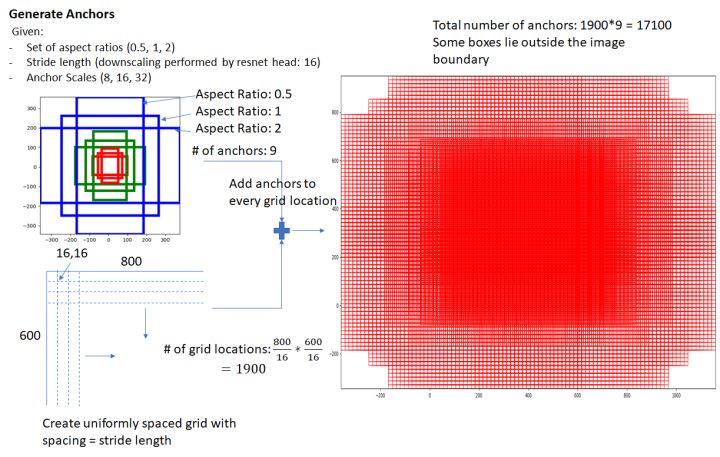
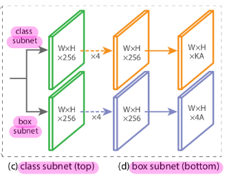

# [paper reading] CornerNet

|   topic   |                          motivation                          |                          technique                           |                         key element                          |                             math                             |                         use yourself                         |                      relativity                      |
| :-------: | :----------------------------------------------------------: | :----------------------------------------------------------: | :----------------------------------------------------------: | :----------------------------------------------------------: | :----------------------------------------------------------: | :--------------------------------------------------: |
| CornerNet | [Problem to Solve](#Problem to Solve) [KeyPoints (Anchor-Free)](#KeyPoints (Anchor-Free)) | [CornerNet](#CornerNet) [Stacked Hourglass Network](#Stacked Hourglass Network) [Prediction Module](#Prediction Module) [Corner Pooling](#Corner Pooling) | [Why CornerNet Better?](#Why CornerNet Better?) [Why Corner Pooling Works](#Why Corner Pooling Works) [Grouping Corners](#Grouping Corners) [Getting Bounding Box](#Getting Bounding Box) [Data Augmentation](#Data Augmentation) [Ablation Experiments](#Ablation Experiments) | [Loss Function](#Loss Function) [Corner Pooling Math](#Corner Pooling Math) | [Network Design](#Network Design) [Interpretability](#Intuition & Interpretability) [Divide Task](#Divide Task) [TTA](#TTA) | [Two-Stage](#Two-Stage) [One-Stage](#One-Stage) |

## Motivation

### Problem to Solve

anchor的使用会带来一些弊端

1.  需要**大量的anchor**

    以确保**ground-truth box的覆盖率**

    这会导致**极端的正负样本不平衡**，导致**训练低效**、**网络退化**

2.  引入许多的**hyperparameters**和**design choice**

    以确保模型对于**各种scale和ratio**的object都具有**良好的基准**

    这在multi-scale的architecture中会更复杂（比如SSD和RetinaNet）

### KeyPoints (Anchor-Free)

即：使用**一对KeyPoints**表示**一个bounding box**

## Technique

### CornerNet

#### Idea

使用**一对KeyPoints**表示**一个bounding box**

#### Architecture

    Pipeline of CornerNet

    Overview of CornerNet

    Detailed Architecture of CornerNet

#### Components

-   **backbone**
-   **2 prediction module**

### Stacked Hourglass Network

#### Components

**Stacked Hourglass Network** = **2 Hourglass Module** ==>  **×4 downsampleing** 

#### Hourglass Module

    每个box都是一个residual module

**hourglass module**对输入的**feature map**进行**5层下采样和上采样**，通过**skip connection**恢复**细节信息**

>   **Hourglass Module**对于**细节信息的恢复**，和**Feature Pyramid Network**的思路是**一样**的

#### Advantage

**Hourglass Network** 可以作为 **object detention** 的**理想选择**

1.  是一个**single unified structure**
2.  可以同时获得 **global** 和 **local** 的**feature**
3.  **多个hourglass module的堆叠**可以提取到**higher-level的信息**

#### Improvement & Settings

本文使用**2个hourglass module**构成hourglass network

改进如下：

-   弃用**max pooling**，使用**stride=2的卷积层**来**降低feature的分辨率**

    在实验中，**resolution降低5次**，对应**upsampling也是5次**

-   **intermediate supervision**

    类似**GoogLeNet**到的**auxiliary classifier**（**gradient injection**）

#### Details

-   **upsample**：

    **2个residual module**，后面再跟**nearest neighbor upsampling**

-   **skip connection**：

    每个**skip connection**也包括**2个residual module**

    （注意2个residual module的位置）

-   **hourglass module** & **residual module**：

    每个**hourglass module**都有**4个通道数为512的residual module**

-   **pre down-sampling**：

    -   $7×7$ Conv，stride=2，channel=128
    -   residual block，stride=2，channel=256

-   **connection between hourglass modules**：

    1.  对**第一个hourglass module**的**Input**和**output**，都经过一个 **1×1 Conv-BN**

    2.  将第1步的结果，进行**对应元素的相加**，在经过1个**256 channel的residual block**
    3.  将第2步的结果，作为第二个hourglass module的输入

-   **prediction**：

    仅使用**最后一层feature map**（不使用Feature Pyramid）

### Prediction Module

-   **heatmap**

    对**top-left corner**和**bottom-right corner**分别预测一个**heatmap** ==> 本质是一个**binary mask**，表明每个location是不是该类的corner

    其维度为 $H×W×C$  $(\text{batch_size}, 128, 128, 80)$，其中 $H$、$W$ 为**输入image的size**，$C$ 为**foreground的类别数**

    >   **heatmap的通道数**为**foreground的类别数**，是因为**不需要对background寻找corner**（当然**分类时**还是需要**将background作为一类**）

    ==> 用以表示**corner**的**location**

    >   可能产生的错误类型：
    >
    >   **一堆corner**中**任何一个的丢失**，会导致**这个object的丢失**（这也是为什么只选择2个corner而不是4个corner来表示object）

-   **embedding**

    对每个检测到的**corner**预测一个**embedding vector**

    其维度为 $H×W×1$  $(\text{batch_size}, 128, 128, 1)$

    ==> 用以使得**同一个object的corner**的**embedding distance**尽可能**小**（**嵌入到子空间的同一位置**）

    >   可能产生的错误类型：
    >
    >   **错误的embedding**，会导致**false bounding box**

-   **offset**

    对**每个corner**预测一个**offset**

    其维度为 $H×W×2$  $(\text{batch_size}, 128, 128, 2)$

    ==> 用以调整**bounding box**的**coordinate**

    >   可能产生的错误类型：

>**不准确的offset**，会导致**松散的bounding box**

### Corner Pooling

>   **Corner Pooling的输出**并**不是直接**用于**heatmap**、**embedding**、**offset**的预测

-   **Introduction**：

    一种**pooling layer**，获得**corner信息的更好表示**

-   **Operation**：

    由于**corner都是在object之外**，所以**无法通过local evidence寻找corner**

    

    所以，采用以下的方式确定corner：

    -   top-left corner：**向左看确定上边界**、**向上看确定左边界**
    -   bottom-right corner：**向右看确定下边界**、**向下看确定右边界**

    以**top-left**为例子，是分别**选取2个feature map**，分别在**2个方向上进行max pooling**

    （**bottom-right pooling**仅仅是**向量的坐标范围**（**pooling的方向**）不同）

    

    

        Overview of Corner Pooling
    

    Details of Corner Pooling (gary layer: 3×3 Conv-BN-ReLU)

    Example of  Corner Pooling

-   **Math Formulation**：

    公式表述见 [Corner Pooling Math](#Corner Pooling Math)

## Key Element

### Why CornerNet Better?

-   **corner**仅仅依赖**2个边**来确定（而center需要4个边来确定）==> **丢失object**的情况会减轻

-   **corner pooling** 可以**encode一些corners的先验知识**

-   corners对于box的表示效率高

    $O(wh)$ 的corners可以表示 $O(w^2h^2)$ 的box

### **Why Corner Pooling Works**

>   有2点有待于实验验证：
>
>   -   Corner Pooling的2个输入feature map的区别
>   -   Stacked Hourglass Network的输出feature map到底长啥样

需要注意：corner pooling只是model的一部分，其**不负责从image中提取feature map**，其**结果也不是直接用于prediction（后续还有处理），**我个人理解为“**corner pooling只是获得了对corner的更好的representation**”，仅此而已。

总结来说，我认为有3点：

-   **Stacked Hourglass Network**本质上是一个**KeyPoint Estimation Network**，进行的是**per-pixel的dense  prediction**，已经能**初步获得**了**corner location的estimation**

-   **Corner Pooling**作为一种**pooling操作**，实现了**pixel信息的空间位置的转移**，将**Hourglass Network估计的信息汇聚到corner**的位置上，获得**corner的更好的representation**

-   使用**2个独立的feature map**，降低了**2路信号的相关性**，使得feature map更专注于**单个direction的edge信息**，

    这是因为一个**corner**（**top-left / bottom-right**）必然有**2路独立的信息来源**

---

**Corner Pooling**本质上是对于**feature map**的一种**pooling操作**

要理解**Corner Pooling**的作用，首先要了解**feature map**的含义

**CornerNet**的**backbone**是**Stacked Hourglass Network**。 **Corner Pooling的输入**就是**Stacked Hourglass Network的输出**

**Stacked Hourglass Network**本质上是一个**KeyPoint Estimation Network**，进行的是**per-pixel的dense  prediction**

具体来说，我认为**Stacked Hourglass Network**已经能**初步获得**了**corner location的estimation**

换句话说，其**每个pixel（location）都具有相对完整的信息**，这个单独的pixel理论上就可以拿去做后续的操作了（而不是像Classification一样需要整张图片才能表示完整的信息）

所以说，Corner Pooling是实现了pixel信息的空间位置的转移，获得corner的更好的representation（原文的描述是 “**help better locate corners**”）

关于**Stacked Hourglass Network能在每个pixel上表示什么信息**，我认为是可以表示**edge（尤其是顶点）**的信息的。因为**Stacked  Hourglass Network**本身就是**非常复杂且完备的KeyPoint Estimation Network**，经过训练我觉得可以表示edge（尤其是顶点）的信息的

此外，**corner pooling会使用2个独立的feature map**，来分别预测**top-most**和**left-most**，类似于2个方向的边缘检测算子的输出。**corner的确定必然有2个独立的信息来源**！如果使用同一个feature map的话，其**最大激活值的位置在corner pooling后依旧还会是最大值**，其**信息具有很强很强的相关性**，corner pooling就失去了意义！

>   关于“**次极大值被抑制**”的问题：
>
>   以**multi-object image**来看，如果在Max Pooling的较前位置出现了极大值，会导致较后位置的**次极大值被抑制**（如下图所示）
>
>   但实际中不会出现这样的问题，原因如下：
>
>   最终**corner的location的确定**，是对**两个Max Pooling方向的支路的element-wise的相加**。换句话说，**corner的位置由两个支路的信息确定**
>
>   当**一个支路的corner信息被抑制**，**另一个支路依旧会独立检测出corner信息**，从而**共同确定corner的location**
>
>   为了画图方便，我们对Corner Pooling的两个支路输入相同的feature map（作图有很多不恰当的地方，仅为了说明思路）
>
>   
>
>   可以看到水平方向的支路中，左侧object的corner信息被抑制了，而垂直方向的支路正常
>
>   将二者相加后：
>
>   
>
>   可以看到，当**水平支路的corner信息被抑制，垂直支路依旧会独立检测出corner信息，从而共同确定corner的location**
>
>   当然，2个支路的corner极值都被抑制的时候，自然是无法检测到这个corner。
>
>   不过鉴于corner所占的位置很小，所以这种事情发生的概率也很小（所以corner pooling 在 **small & large area** 都是 **effective & stable**）

### Grouping Corners

根据**corners**的**embedding distance**对corners进行分组

**同一组的corner**的**embedding distance应该小**

### Getting Bounding Box

>   NMS ==> top-100 ==> offset ==> grouping ==> reject ==> score

测试时，根据**heatmap**、**embedding**、**offset**生成bounding box

1.  对**corner heatmap**进行**NMS**（**3×3 max pooling**）

2.  从**corner heatmap**中选取**top-100的corner**

3.  根据**offset**微调**corner location**

4.  计算**corners的embedding**的**L1 distance**

5.  **拒绝两类corner pair**：

    -   **distance** > 0.5
    -   corners来自不同的**category**

6.  计算**detection score**：

    对**top-left corner**和**bottom-right corner**的**score取平均**

### Data Augmentation

#### Training

-   **horizontal filpping**

-   **scaling**

-   **croping**

-   **color jittering**
    -   **brightness**（亮度）
    -   **saturation**（饱和度）
    -   **constrast**（对比度）

#### Testing

-   保留**原始分辨率**，补零到511×511（输出维度为128×128）
-   **original & filpped**：
    1.  汇聚二者的的detection
    2.  soft-nms抑制冗余的detection
    3.  取top-100的detection

### Ablation Experiments

#### Corner Pooling

corner pooling对于**中目标和小目标**的提升大

#### Stability of Corner Pooling over Larger Area

corner pooling 在 **small & large area** 都是 **effective & stable**

>   area范围的由来：
>
>   -   corner pooling仅作用于 $\frac14$ 圆周（四个象限之一）
>   -   根据 $(i,j)$ 的不同，area的范围也不同

#### Reducing Penalty to Negative Locations

**penalty reduction有效**（尤其是对于**中目标和大目标**）

**原因**：**中目标和大目标**对于**corner location的要求**更低

#### Hourglass Network Works

有两个结论：

-   **backbone的选择**很重要
-   **hourglass**对**CornerNet**的性能**很重要**

#### Quality of the Bounding Boxes

**CornerNet**可以产生**质量更高的bounding box**

>   衡量标准：**bounding box**与**object**的**IoU**

#### Error Analysis

**结论**：

1.  **CornerNet的主要瓶颈**是 **detecting corners**
2.  **detecting corners** 和 **grouping corners** 均有提升空间

#### Compared to SOTA

## Math

### Loss Function

$$
L = L_{det} + \alpha L_{pull} + \beta L_{push} + \gamma L_{off}
$$

#### Detection Loss 

**每个corner**只对应**一个location的positive**，**其他location均为negative**

由于**positive附近的点**依旧能**产生良好的bounding box**，故**对positive一定radius内的negative降低惩罚**

-   **radius的确定**

    对于**不同size的object**，要求**radius内的一对点**，与g**round-truth box的IoU**要**大于阈值**（实验中阈值设定为**0.3**）

-   **惩罚的减少量**

    由**unnormalized 2D Gaussian**确定
    $$
    e^{-\frac{x^2+y^2}{2\sigma^2}}
    $$

    -   中心为positive location
    -   $\sigma$ 为radius的 $\frac13$

**Detection Loss** 为 Focal Loss 的变种：
$$
L_{d e t}=\frac{-1}{N} \sum_{c=1}^{C} \sum_{i=1}^{H} \sum_{j=1}^{W}\left\{\begin{array}{cc}
\left(1-p_{c i j}\right)^{\alpha} \log \left(p_{c i j}\right) & \text { if } y_{c i j}=1 \\
\left(1-y_{c i j}\right)^{\beta}\left(p_{c i j}\right)^{\alpha} \log \left(1-p_{c i j}\right) & \text { otherwise }
\end{array}\right.
$$

-   $y_{cij}$ ：**unnormalized Gaussian** 增强的 **ground-truth heatmap**

    $(1-y_{cij})$ 起到**降低惩罚的作用**

-   $p_{cij}$ ：**heatmap**上类别为 $c$ 的 $(i,j)$ 位置的**score**

-   $N$ ：**image中的object的数目**

-   $\alpha, \beta$ ：两个起**调节作用**的**超参数**

#### Offset Loss

由于**降采样**，**image**中 $(x,y)$ 会**map**到**heatmap**的 $(\lfloor \frac x n \rfloor,\lfloor \frac y n \rfloor)$ 上

从**heatmap**去**remap**到**image**时会**损失一些精确的信息**，这会**严重影响small bounding box的IoU**

所以要通过**offset**对**corner location**进行**微调**

令**offset** $\boldsymbol{o}_{k}$ 为：
$$
\boldsymbol{o}_{k}=\left(\frac{x_{k}}{n}-\left\lfloor\frac{x_{k}}{n}\right\rfloor, \frac{y_{k}}{n}-\left\lfloor\frac{y_{k}}{n}\right\rfloor\right)
$$
**Offset Loss** 定义为 $\boldsymbol{o}_{k}$ 的 **smooth L1 Loss**
$$
L_{off} = \frac 1 N \sum_{k=1}^N \text{SmoothL1Loss} (\boldsymbol{o}_{k}, \hat{\boldsymbol{o}}_{k} )
$$

#### Pull Loss

使得**同一组的corner**的**embedding distance**尽可能**小**（**embedding相同**），即使得 $e_{t_{k}}=e_{b_k}=e_{k}$

$$
L_{p u l l}=\frac{1}{N} \sum_{k=1}^{N}\left[\left(e_{t_{k}}-e_{k}\right)^{2}+\left(e_{b_{k}}-e_{k}\right)^{2}\right]
$$

-   $e_{t_{k}}$ ：top-left corner的embedding
-   $e_{b_k}$ ：bottom-right corner的embedding
-   $e_{k}$ ：$e_{t_{k}}$ 和 $e_{b_k}$ 的均值

#### Push Loss

使得**不同组corners的embedding distance尽可能大**

-   $\Delta$ ：实验中设定为1

>   **Pull Loss 和 Push Loss**从**embedding的角度**来看，是使得**类内距离小，类间距离大**

### Corner Pooling Math

$$
t_{ij}=
\left\{\begin{array}{cc}
\text{max} (f_{t_{ij}}, t_{(i+1)j}) & \text { if }i<H \\
f_{t_{Hj}} & \text { otherwise }
\end{array}\right.
$$

$$
l_{ij}=
\left\{\begin{array}{cc}
\text{max} (f_{l_{ij}}, t_{(i+1)j}) & \text { if } j<W \\
f_{t_{iW}} & \text { otherwise }
\end{array}\right.
$$

-   $f_t$ 和 $f_l$ ：top-left Corner Pooling的输入feature map
-   $f_{t_{ij}}$ 和 $f_{l_{ij}}$ ：$f_t$ 和 $f_l$ 在 $(i,j)$ 处的vector
-   $t_{ij}$ ：在 $f_t$ 的 $(i,j)$ 和 $(i,H)$ 进行max pooling的结果
-   $l_{ij}$ ：在 $f_l $ 的 $(i,j)$ 和 $(W,j)$ 进行max pooling的结果

上面两个式子都是一种**递归调用**，$f_{t_{Hj}}$ 作为 $t_{ij}$ 的**递归边界**，$f_{t_{iW}}$ 作为 $l_{ij}$ 的**递归边界**

表明**从边界向点 $(i,j)$ 计算max-pooling**

## Use Yourself

### Network Design

网络的**基本组件**（卷积层、residual block，Inception module等）都可以**服务于特定的设计目的**，这种思路跟**搭积木**很像

举几个例子：

**Faster-RCNN 的 RPN**：

**RetinaNet的FPN**：

**CornerNet 的 prediction module**

从这3个例子可以看到，**网络的设计思路**在这里起到了很重要的作用

这是一种**自顶向下的设计思路**，是确定**网络的功能**，再通过**具体的组件去实现**所设计的功能

>   所以说，“直接套用之前论文中设计好的子网络”是一种错误的想法，真正的正确的思路应该是“**从论文中学习设计思路**”

甚至从更广义来说，**backbone**也不是让你拿过来就用的

-   一方面，需要**对backbone进行修改**，以**适应后续的操作**

-   另一方面，**backbone**中蕴含的**设计思路**，**比backbone本身更有意义**

### Intuition & Interpretability

#### Interpretability For Delicate Motivation

回顾detection的发展，可以看出其对于**网络结构和feature map**的**可解释性和理解深度**的要求是逐渐加深的，只有这样才能设计出**更巧妙更精致的方法**

从对feature map的理解上看

-   **Faster-RCNN**：

    **Faster-RCNN**作为**two-stage**方法，思路是**proposal + classification**

    **Faster-RCNN甚至不需要去关注image中的object会对应到feature map的什么位置**，因为其**在feature map上进行的是 dense & grid 的饱和式采样**

    这种思路其实是**将feature map视作了黑箱**

    

-   **YOLO v1**：

    **YOLO v1** 作为**首个one-stage方法**，使用**regression**的方法进行**detection**

    YOLO v1在**classification**上有**segmentation**的意味

    这使得我们必须要知道，**image中的object会对应到feature map的什么位置**

    这在**image和feature map的location relationship**上迈出了关键一步

    

-   **SSD**：

    **SSD**作为**one-stage**的方法，使用了**multi-scale的feature maps**

    **SDD**主要回答了**2个问题**：

    1.  使用**不同level的feature map**进行detection有什么区别？
    2.  使用**多个level的feature map**是否会提高detection的性能？

    具体来说

    -   对于第一个问题：SSD证明了**不同level的feature map具有不同的detailed/location information和semantic information**，且二者为**负相关**的关系（即**detailed/location information和semantic information难以兼顾**）

    -   对于第二个问题：SSD进行了feature map的multi-scale，证明了**结合不同stage的feature map可以提高detection的性能**

    SSD其实提出了 Feature Pyramid Network 的雏形。但**SSD**为了**保证feature map的strong semantic**，将使用的**所有feature map都限制在了low-resolution**（即使用**backbone的输出作为pyramid的第一层**）

    SSD真正去关注了feature map到底represent了什么信息，以及其representation能力随stage的变化情况

    

-   **RetinaNet**：

    **RetinaNet**使用了**完整的FPN**，不再将feature map限制在low-resolution上，实现了**在high-resolution上也能获得strong semantic的feature map**

    **Feature Pyramid Network**（**high-resolution & strong semantic的feature map**的获得）将**对于feature map所携带信息的理解更深入了一层**

    

-   **CornerNet**：

    **CornerNet**通过在**feature map**上进行**Corner Pooling**来获得**feature map中包含的Corner信息**

    **CornerNet**真正**关注了feature map中每个pixel的含义**，及其**表示的representation**，将**对feature map的representation的理解深入细化到了pixel-level**

    其对于**feature map**的**不同位置**的**信息流动（object位置的信息流动到corner位置）**，也是一次有意义的尝试

    

#### Anchor-Based or Anchor-Free

-   从feature map的**生成**来看：

    即**如何获得high-resolution & strong semantic的feature map**

    从Faster-RCNN和YOLO的**single-scale**，到SSD的**multi-scale**，最后到RetinaNet使用的**FPN**，**基本解决了这个问题**

-   从feature map的**使用**来看：

    -   **Faster-RCNN**、**SSD**、**RetinaNet**等方法均为**anchor-based**，其对于feature map的操作是**饱和式检测**，**对feature map的内在信息的挖掘不足**

        其对**feature map使用的精细度**是在**整个feature map的level上**

    -   在**anchor-free**的方法中：

        -   **YOLO**的**分类**的思想类似于**segmentation**，对feature map的使用是**patch-level**（**每个grid cell对应的feature map是最小单位**）

        -   **CornerNet**真正开启了在**pixel-level**上**使用feature ma**p的序幕，该方法**对feature map中信息的挖掘和利用**远远高于anchor-based方法和YOLO

            之后的anchor-free方法都可以划分到此类

### Divide Task

要在**同一个feature map**上实现**多个功能**，可以采用**多个支路**分别进行

是否还对**信息进行聚合**，取决于其**使用位置**

    RPN

    class+box subnet of RetinaNet

    prediction module of CornerNet

### TTA

主要是**color jitter** 和 **horizontal flip**

>   要注意horizontal flip如何聚合检测结果：**先聚合，再NMS**

## Related Work

### Two-Stage

two-stage的常规思路是：

1.  **stage-1** 生成 **sparse set of regions of RoI**
2.  **CNN**对regions进行**分类**

#### R-CNN

使用 **low-level vision algorithm 获得RoI**，**ConvNet进行分类**

-   非端到端
-   计算冗余

#### SPP & Fast-RCNN

从**feature map中获取RoI**，**ConvNet分类**

-   依旧是**分立的proposal算法**，无法端到端训练

#### Faster RCNN

引入**RPN**，从**anchor**中获取**proposals**

-   efficient
-   end-to-end

#### R-FCN

将sub-detection network从fully connected变为fully convolutional

#### DeNet

**不使用anchor的two-stage方法**

**steps**：

1.  确定一个**location**有多大的可能是4个**corner**之一
2.  列出**corner**所有的组合方式，获得**RoI**
3.  **CNN**对**RoI**进行分类

**difference compared to CornerNet**：

-   **DeNet不判断corner是否属于一个object**，而是通过**sub-detection network拒绝poor Rois**
-   **DeNet**需要进行**手动的feature selection**
-   **CornerNet**引入了**corner pooling层**

### One-Stage

one-stage的常规思路是：

1.  在**image**上 **dense & regular** 地放置**anchor**
2.  通过 **scoring anchor** 来获取最后的 **bounding box predictions**
3.  通过**regression**对**coordinate微调**

#### YOLO

直接在**image**上预测**bounding box和coordinate**（后续版本也用回了anchor）

#### SSD

在**multi-scale的feature map**上 **dense & regular** 放置**anchor**

#### DSSD & RON

通过**skip connection**结合**low-level和high-level的features**（类似**Hourglass**）

#### RetinaNet

**Focal Loss**

#### RefineDet

滤除一部分的**negative box**，对**anchor进行粗调**

#### Point Linking Network（PLN）

**不使用anchor的one-stage方法**

**steps**：

1.  预测**bounding box**的**4个corner**和**1个center**的**location**
2.  构造**corner-center pair**
    -   对于**corner**，预测**每个pixel**有多大的可能是**center**
    -   对于**center**，预测**每个pixel**有多大的可能是**corner**
3.  根据**corner-center pair**生成**bounding box**
4.  将**4个bounding box**去**merge**为**1个bounding box**

**difference compared to CornerNet**：

-   **PLN**通过预测**pixel的location**来**group corner & center**

    （**CornerNet**通过**embedding vecto**r来**group corner & center**）

-   **CornerNet**使用**corner pooling**，以更好地**定位corner**

## Blogs

-   CornerNet结构的代码：[【Anchor free】CornerNet 网络结构深度解析（全网最详细！）](https://zhuanlan.zhihu.com/p/188587434)
-   CornerNet的ground-truth处理、Loss Function的代码：[【Anchor free】CornerNet损失函数深度解析（全网最详细！）](https://zhuanlan.zhihu.com/p/195517472)

-   Corner Pooling的具体作用：[CornerNet算法解读](https://zhuanlan.zhihu.com/p/53407590)

