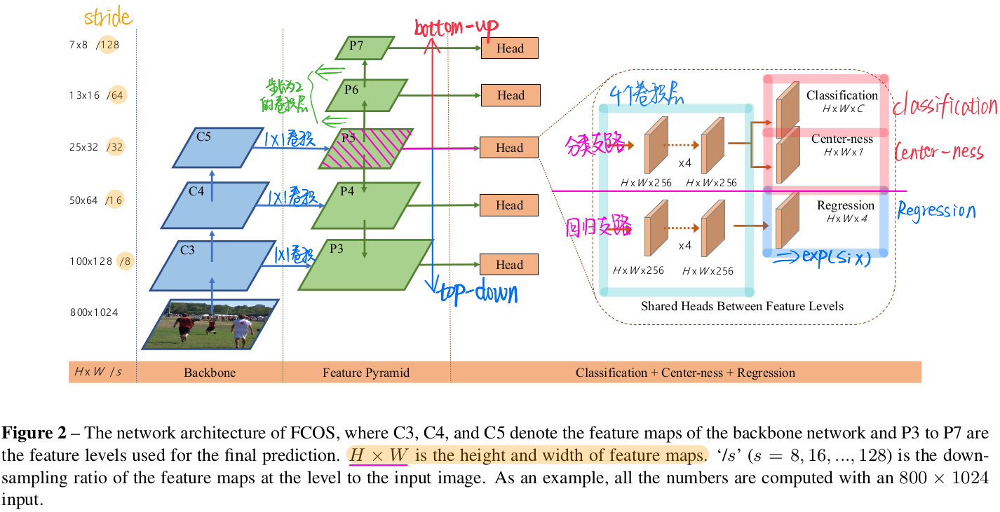
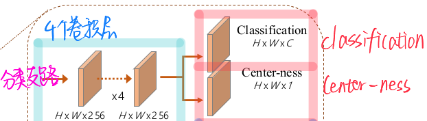
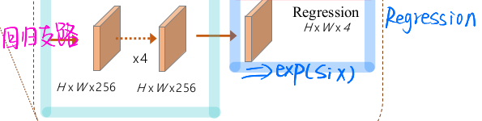

# [paper reading] FCOS

|               topic               |                    motivation                    |                          technique                           |                         key element                          |                             math                             |                         use yourself                         |
| :-------------------------------: | :----------------------------------------------: | :----------------------------------------------------------: | :----------------------------------------------------------: | :----------------------------------------------------------: | :----------------------------------------------------------: |
| [FCOS](./[paper reading] FCOS.md) | [Idea](#Idea) [Contribution](#Contribution) | [FCOS Architecture](#FCOS Architecture) [Center-ness](#Center-ness) [Multi-Level FPN Prediction](#Multi-Level FPN Prediction) | [Prediction Head](#Prediction Head) [Training Sample & Label](#Training Sample & Label) [Model Output](#Model Output) [Feature Pyramid](#Feature Pyramid) [Inference](#Inference) [Ablation Study](#Ablation Study) [FCN & Detection](#FCN & Detection) [FCOS $vs.$ YOLO v1](#FCOS $vs.$ YOLO v1) | [Symbol Definition](#Symbol Definition) [Loss Function](#Loss Function) [Center-ness](#Center-ness) [Remap of Feature & Image](#Remap of Feature & Image) | [Physical & Prior Knowledge](#Physical & Prior Knowledge) [Design or Adaptive](#Design or Adaptive) [Sample & Filter Strategy](#Sample & Filter Strategy) [Generalized Keypoint-based](#Generalized Keypoint-based) |

## Motivation

### Idea

用**per-pixel prediction**的方法进行**object detection**（通过**fully convolution**实现）

### Contribution

1.  将**detection**重新表述为**per-pixel prediction**

2.  使用 **multi-level prediction**：

    -   提升**recall**
    -   解决**重叠bounding box**带来的**ambiguity**

3.  **center-ness branch**

    **抑制**bounding box中的**low-quality prediction**

## Techniques

### FCOS Architecture

>   backbone的默认选择是**ResNet-50**

#### Advantage

> 详见 [Drawbacks of Anchor](#Drawbacks of Anchor)

- **Detection**与**FCN-solvable task** (e.g. **semantic segmentation**) **unify**到一起

  一些**其他任务的Idea**也可以**迁移到detection**中（**re-use idea**）

- **anchor-free** & **proposal-free**

- 消除了与**anchor**相关的**复杂计算 **(e.g. **IoU**)

  获得 **faster training & testing**，**less training memory footprint**

- 在**one-stage**中做到了**SOTA**，可以用于**替换PRN**

- 可以**快速迁移**到**其他的vision task** (e.g. instance segmentation, key-point detection)

### Center-ness

>   **center-ness**是对**每个location**进行**预测**
>
>   可以**极大地提高性能**

#### Idea

在**远离center的位置**会产生**大量**的**low-quality**的**predicted bounding box**

**FCOS**引入了**center-ness**，**抑制远离center的low-quality bounding box**（e.g. **down-weight**）

#### Implement

引入**center-ness branch**，来预测**location的center-ness**

在**测试**时：

1.  通过下式计算**score**：
    $$
    \text{Final Score} = \text{Classification Score} × \text{Center-ness}
    $$

2.  使用**NMS**滤除**被抑制的bounding box**

### Multi-Level FPN Prediction

>   **Multi-Level FPN Prediction**能解决**2个问题**：
>
>   -   **Best Possible Recall**
>
>       将**FCOS**的**Best Possible Recall**提升到**SOTA**
>
>   -   **Ambiguity of Ground-Truth Box Overlap**
>
>       解决**ground-truth box重叠**带来的**ambiguity**，达到anchor-based程度
>
>       原因：绝大部分情况下，发生**重叠的object**，**尺度差距都很大**

**Idea**是：根据**regress distance的不同**，将**需要回归的location**分发到**不同的feature level**

具体来说：

1.  计算**regress target**

    

2.  根据**feature level**的**maximum regress distance**，筛选出**positive sample**
    $$
    m_{i-1} < \text{max}( l^*, t^*,r^*,b^* ) < m_i
    $$
    其中 $m_i$ 是**feature level** $i$ 需要**regress的maximum distance**
    $$
    \{m_2, m_3, m_4, m_5, m_6, m_7\} = \{ 0,64,128,256,512 \}
    $$

    >   相比于原始的FPN（e.g. SSD），**FCOS**将**不同scale的object“隐性“地分到了不同的feature level（small在浅层，large在深层）**
    >
    >   我认为这可以看做**更精致的手工设计**

3.  若**1个location落到2个ground-truth box**（e.g. **ambiguity**）中，则选择**small box进行regression**（更**偏向小目标**）

## Key Elements

### Prediction Head

#### Classification Branch

#### Regression Branch

由于**regression target永远是正数**，所以在regression branch的top续上**exp($s_ix$)**（详见 [Shared Head](#Shared Head)）

#### Shared Head

在**不同feature level**共享**head**

**Advantage**：

-   **parameter efficient**
-   **improve performance**

**Drawback**：

由于[Multi-Level FPN Prediction](#Multi-Level FPN Prediction)的使用，会使得不同feature level的输出范围有所不同（e.g. [0, 64] for $P_3$，[64, 128] for $P_4$）

为了使得identical heads可以用于different feature level：
$$
\text{exp}(x) \rightarrow \text{exp}(s_ix)
$$

-   $s_i$ ：**trainable scaler**，用来自动调整exp的base

### Training Sample & Label

#### Training Sample

直接将**location**作为**training sample**（这和语义分割的FCN相似）

#### Label Pos/Neg

**location** $(x,y)$ 为**正样本**的条件为：

1.  **location** $(x,y)$ 落在 **ground-truth box中**
2.  **location** $(x,y)$  **的类别** == 该**ground-truth box**的类别

**FCOS**使用了**尽可能多的foreground sample**来**训练**（e.g. **ground-truth box的全部location**）

>   而不**像anchor-based**仅选用与**ground-truth box高**的作为**正样本**
>
>   也不像[CenterNet (Object as Points)](./[paper reading] CenterNet (Object as Points).md) 只对**geometric center**作为**正样本**

### Model Output

对**每个level的feature map**的**每个location**有如下的输出：

#### **4D Vector $\pmb t^*$**

$$
\pmb t^* = (l^*,t^*,r^*,b^*)
$$

描述了**bounding box的4个side**相对于**该location**的**relative offset**

具体来说：

>   注意：
>
>   **FCOS**是对**ground-truth box的每个location**进行计算（并**不仅仅是geometric center**），所以需要预测**4个量**来获得**boundary**
>
>   像 [CenterNet (Object as Points)](./[paper reading] CenterNet (Object as Points).md) 只对**geometric center**进行预测，2个量就够了

>   注意：**object重叠**的问题可以通过 **[Multi-Level FPN Prediction](#Multi-Level FPN Prediction)** 解决。但如果**仍发生重叠**，则**优先考虑小样本**（选择**面积最小的bounding box**）

#### **C-Dimension Vector $\pmb p$**

实验中使用的不是 **C-class classifier**，而是 **C** 个**binary classifier**

### Feature Pyramid

定义了5个level的feature map：$\{P_3, P_4, P_5, P_6, P_7\}$（步长为 $\{8,16,32,64,128\}$）

-   $\{P_3,P_4,P_5\}$：**backbone的feature map** $\{ C_c, C_4,C_5\}$ + **1×1 Convlution**
-   $\{P_6,P_7\}$ ：$P_5$ & $P_6$ 经过stride=2的卷积层

### Inference

1.  将image输入network，在**feature map** $F_i$ 的**每个location**获得：
    -   **classification score $\pmb p_{x,y}$**
    -   **regression prediction $\pmb t_{x,y}$**

2.  选择 $\pmb p_{x,y} > 0.5$ 的**location**，作为**positive sample**

3.  **decode**得到**bounding box的coordinate**

    

### Ablation Study

#### Multi-Level FPN Prediction

**结论**：

-   **Best Possible Recall** 并不是FCOS的问题
-   Multi-Level FPN Prediction可以提高**Best Possible Recall**

#### Ambiguity Samples

结论：

-   **Multi-Level FPN Prediction可以解决Ambiguity Samples的问题**

    即：**大部分的overlap ambiguity**会被分到**不同的feature level**，只有**极少的ambiguity location还存在**

#### With or Without Center-ness

-   **Center-ness**能抑制远离center的low-quality bounding box，从而**大幅度提高AP**

-   center-ness**必须具有单独的支路**

    

### FCN & Detection

**FCN** 主要用于 **dense prediction**

其实**fundamental vision task**都可以**unify**到**one single framework**

而**anchor**的使用，实际上使得**Detecntion**任务**偏离**了**neat fully convolutional per-pixel prediction framework**

### FCOS $vs.$ YOLO v1

相比于**YOLO v1**只使用**靠近center的point**进行**prediction**，**FCOS**使用**ground-truth的全部点**进行**prediction**

对于产生的**low-quality bounding box**，由**center-ness**进行抑制

使得**FCOS**可以达到**anchor-based detectors相近的recall**

## **Math**

### Symbol Definition

-   $F_i \in \mathbb{R} ^{H×W×C}$ ：backbone中第 $i$ 层的**feature map**

-   $s$ ：到该层的**total stride**

-   $\{B_i\}$ ：**ground-truth box**
    $$
    B_i = (x_0^{(i)}, y_0^{(i)},x_1^{(i)},y_1^{(i)},x^{(i)})  \in \mathbb{R}^4 × \{ 1,2...C\}
    $$

    -   $(x_0^{(i)}, y_0^{(i)})$ ：**top-left corner coordinate**
    -   $(x_1^{(i)}, y_1^{(i)})$ ：**bottom-right corner coordinate**
    -   $c^{(i)}$ ：**bounding box中object的class**
    -   $C$ ：**number of class**

### Loss Function

-   $\lambda = 1$

>   还缺少一个Center-ness Loss，其为binary cross entropy

该损失在feature map的全部location上计算，具体来说：

-   **Classification Loss**在**全部location**上计算（**positive** & **negative**）

-   **Classification Loss**在**positive location**上计算

    $\mathbb{1} _{\{ C_{x,y}^* > 0\}} = 1$ if $c_i^*>0$

### Center-ness

$$
\text { centerness* }=\sqrt{\frac{\min \left(l^{*}, r^{*}\right)}{\max \left(l^{*}, r^{*}\right)} \times \frac{\min \left(t^{*}, b^{*}\right)}{\max \left(t^{*}, b^{*}\right)}}
$$

-   **center-ness**反映l**ocation**到**对应center**的**normalized distance**
-   使用“**根号**”来**延缓center-ness的衰减**
-   center-ness的范围为 **[0,1]**

### Remap of Feature & Image

feature map上的 $(x,y)$，映射回原图像为：
$$
\big(  \lfloor \frac s2 \rfloor + xs , \lfloor \frac s2 \rfloor + ys \big)
$$
该位置会靠近**location** $(x,y)$ 的对应的**reception field**的**center**

## Use Yourself

### Physical & Prior Knowledge

-   从**物理意义**的角度：

    **center-ness**可以**encode关于center的物理意义**，从而**筛选出center-like的位置**，即：**没有被down-weight的location都近似具有center的物理意义**

-   从**先验知识**的角度：

    **center-ness**其实**encode了关于bounding box的先验知识**，即**边界的location难以产生高质量的bounding box**

启示：如果能找到合理的方式去**将先验知识嵌入到模型中**，使之**具备一定的物理意义**，应该可以在**性能上获得一些提升**

### Design or Adaptive

关于**multi-size的object**如何在**multi-scale的feature level**上进行detection：

在之前的网络中（e.g. **RetinaNet的FPN**）都是**不指定何种size由哪层去detect**，属于**自适应**的方法

而**FCOS**的**Multi-level FPN Prediction**把**特定size的object分配到特定的feature level**，属于**手工设计**的方法

具体采用**Design还是Adaptive**，取决于面对的问题。就目前来看，我的看法：

-   **自适应方法**：

    需要当前方法有效，其自适应调整较轻微（还是按照这个架子），且有几乎稳定的正收益

-   **手工设计**：

    当前方法的分配关系比较混乱（一对多的对应关系），specialized程度低，可通过手工设计转化为1对1的对应关系

### Sample & Filter Strategy

总的来说，**sample**和**filter**是一对**trade-off**

一般来说，sample的点越多越好，但其空间和时间的占用都会增加，对post-processing的需求也增加

最好还是**尽可能多地利用候选样本点，再通过尽可能简单的方式过滤掉冗余的样本**（e.g. FCOS的classification score * center-ness）

### Generalized Keypoint-based

**FCOS = CenterNet (object as points) + Center-ness**

**CenterNet (object as points)** 相当于**只选用bounding box的geometric center（几何中心）**进行bounding box的预测（e.g. bounding box的 $W,H$），所以其检测到的center到各边的距离为 $(\frac{W}{2}, \frac{H}{2})$

而**FCOS**使用了**ground-truth bounding box内的所有location**进行预测（e.g. $r^*,l^*,t^*,b^*$），但使用**center-ness**对**远离center的location**进行了**高效率的抑制**

**FCOS**其实也是**generalized keypoint-based的思路**，只不过像**传统的keypoint**（e.g. **CornerNet**，**CenterNet**），其**keypoint具有实际的物理意义**（e.g. **center**，**corner**），而**FCOS的keypoint为ground-truth bounding box的全部location**，而通过**center-ness来赋予其物理意义**

简而言之，**FCOS**最终用于**产生predicted bounding box的location**是**center-like**的，即：

-   在**空间位置上**：并**不一定是geometric center**
-   但是具有**类似center的物理意义和先验知识**

## Related Work

### Drawbacks of Anchor

1. **detection performance**对**size**、**aspect ratio**、**number of anchor**等超参数**敏感**

   即**anchor**需要**精密的手工设计**

2. 需要**大量的anchor**，才能获得**high recall rate**

   这会导致**训练**时**极端的正负样本不均衡**

3. **anchor**会伴随着**复杂的计算**

   比如**IoU**的计算

4. **anchor**的**size**、**aspect ratios**都是**预先定义**的，导致无法应对**shape variations**（尤其对于小目标）

   另外，**anchor**这种“**预先定义**”的形式也会**影响模型的泛化能力**。换句话说，设计的**anchor**是**task-specific**

### **DenseBox**-Based

- 对image进行crop和resize，以处理不同size的bounding box 

  导致DenseBox必须在image pyramid上进行detection

  这与FCN仅计算一次convolution的思想相悖

- 仅仅用于特定的domain，难以处理重叠的object

  因为无法确定对应pixel回归到哪一个object

  

- Recall比较低

### Anchor-Based Detector

- **来源**：

  sliding window 和 proposal based detectors

- **anchor的本质**

  预定义的sliding window (proposal) + offset regression

- **anchor的作用**

  作为detector的训练数据

- **典型model**
  - Faster-RCNN
  - SSD
  - YOLO v2

### YOLO v1

**YOLO v1**是典型的Anchor-Free Detector

#### Idea

**YOLO v1**使用**靠近center的point**来**预测bounding box** 

即：object的center落到哪个grid cell，则由该cell负责预测该object的bounding box

这是因为：**靠近center的points**能生成**质量更高的detection**

#### Drawbacks of Points near Center

**只使用靠近center的points，会导致low-racall**

> 正因如此，YOLO v2 又重新使用了anchor

### CornerNet

**CornerNet**是典型的Anchor-Free Detector

#### Steps

1. **corner detection**
2. **corner grouping**
3. **post-processing**

#### Drawbacks of Corner

**post-processing**复杂，需要额外的**distance metric**