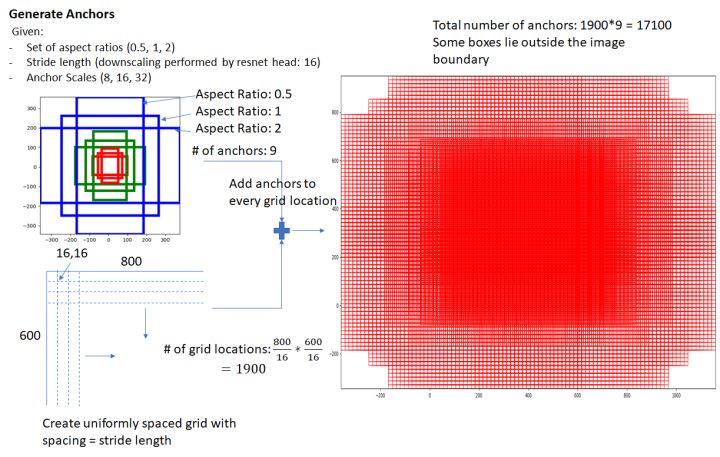
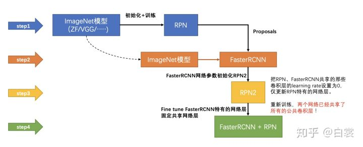

# [paper reading] Faster RCNN

>   https://arxiv.org/abs/1506.01497

|                          motivation                          |                          technique                           |                         key element                          |                         use yourself                         |                             math                             |
| :----------------------------------------------------------: | :----------------------------------------------------------: | :----------------------------------------------------------: | :----------------------------------------------------------: | :----------------------------------------------------------: |
| [Problem to Solve](#Problem to Solve) [Proposal with CNN](#Proposal with CNN) | [Architecture](#Architecture) [Region Proposal Network](#Region Proposal Network) [RoI Pooling](#RoI Pooling) [Anchor](#Anchor) | [anchor/proposals/bbox](#anchor/proposals/bbox) [Pyramids](#Pyramids) [Positive & Negative Label](#Positive & Negative Label) [Sampling Strategy](#Sampling Strategy) [4-Step Alternating Training](#4-Step Alternating Training) | [Architecture](#Architecture) [Region Proposal Network](#Region Proposal Network) [RoI Pooling](#RoI Pooling) [Anchor](#Anchor) | [Loss Function](#Loss Function) [Coordinates Parametrization](#Coordinates Parametrization) |

## Motivation

### Problem to Solve

**Fast-RCNN 和 SPPnet 的性能瓶颈**在 **region proposals** 上， region proposal 占据了大量的时间。

>   Advances like **SPPnet** [1] and **Fast R-CNN** [2] have reduced the running time of these detection networks, exposing **region proposal computation as a bottleneck**

### Proposal with CNN

**Faster-RCNN = Fast-RCNN + RPN**，即**使用CNN直接计算proposal**

-   其中 **Fast-RCNN** 充当 **detection network**

## Technique

### Architecture

-   **Conv layers**

    -   输入：image
    -   输出：shared feature map（被后续的RPN和detection network共享）

    卷积层使用**same-padding**保持卷积前后的空间分辨率，在**池化层进行下采样**（长宽都变为原来的 $\frac12$） ==> **feature map的任一点均可对应原图的一个grid**

-   **[Region Proposal Network](#Region Proposal Network)**

    -   输入：shared feature map

    -   输出：proposals 和 regression loss

    >   RPN 用于生成 region proposals
    >
    >   -   判断**anchors属于positive或者negative**
    >   -   利用**bounding box regression修正anchors获得精确的proposals**

-   [**Roi Pooling**](#Roi Pooling)

    -   输入：shared feature maps 和 proposals
    -   输出：proposal feature maps

-   **Classification**

    -   输入：proposal feature maps
    -   输出：bounding box 和 score

### Region Proposal Network

#### Idea

-   **Convolutional Feature Sharing**

    **Region Proposal Network** 通过和 **detection network 共享full-image的卷积特征**，实现了几乎**cost-free的region proposal**（通过**共享卷积层**实现）

    >   In this work, we introduce a **Region Proposal Network** (RPN) that shares f**ull-image convolutional features** with the **detection network**, thus enabling **nearly cost-free region proposals**

-   **"Attention" Mechanism**

    **RPN** 告诉网络去**关注何处**

    >   We further **merge RPN and Fast R-CNN into a single network** by **sharing their convolutional features**—using the recently popular terminology of neural networks with **“attention” mechanisms**, the **RPN component tells the unified network where to look**.

#### Essence

**RPN** 是**几层卷积层**，本质上相当于**可以生成 proposal 的 FCN（fully convolutional layers）**

>   we construct an **RPN** by adding **a few additional convolutional layers**

>   The **RPN** is thus a kind of **fully convolutional network (FCN)** [7] and can be **trained end-to-end** specifically for the task for **generating detection proposals**.

#### Components

>   This architecture is naturally implemented with a **n×n convolutional layer** followed by **two sibling 1×1 convolutional layers** (for **reg** and **cls**, respectively).

-   **$n×n$ convolutional layer**

    在**共享卷积层输出的feature map**上提取 $3×3$ 的窗口，并映射到**低维的feature**。

    >   256-d for ZF and **512-d for VGG**, with ReLU following

    -   即便选取较小的 $n$ ，在原图上依旧能对应较大的 **reception filed**

        >   We use **n= 3** in this paper, noting that the **effective receptive field** on the **input image** is **large** (171 and 228 pixels for ZF and VGG, respectively). 

-   **box-classification layer** & **box-regression layer**

    2路 **1x1 Conv**，分别负责输出 **objectness scores** 和 **rectangle object proposals**

    >   这说明 1x1 Conv 也能起到**分类器**的作用，显示出卷积层同FC层一样具有**生成器**的性质
    
    -   上路：softmax分类anchors获得**positive和negative分类**
    -   下路：**anchors对于ground-truth box的偏移量**，以获得**精确的proposal**
    
    -   Proposal层：positive anchors和bbox regression偏移量 ==> proposals（同时剔除太小和超出边界的proposals）
    
    由于 **RPN** 是以 **sliding-window** 的方式滑动，**2路 1x1 Conv 各自在空间位置上共享**。
    
    >   Note that because the **mini-network** operates in a **sliding-window fashion**, the **fully-connected layers** are **shared across all spatial locations**
    
    整个网络到了**Proposal Layer** 这里，就完成了相当于**目标定位**的功能

#### Purpose

用于获得**不同scale和ratios的proposal**

>   RPNs are designed to efficiently predict **region proposals** with a wide range of **scales and aspect ratios**.

#### Input & Output

-   **input**

    **shared feature map**

-   **Output**

    **positive + anchor offset = proposals**
    
    -   **box-classification layer** ==> **objectness scores (positive/negative)**  
    -   **box-regression layer** ==> **rectangle object proposals**

### RoI Pooling

#### Essence

ROI Pooling 其实是对proposal区域的进行的**像素/特征重采样**过程

#### Idea & Purpose

**通过将图片划分为固定长度的网格，实现对不同size的图片提取得定长的feature**

### Anchor

**3个scale**，每个scale有**3个ratios**

即：每个feature map的location有 $3×3=9$ 个anchor

#### Idea & Purpose

**Pyramids of reference boxes (预定义的proposals)**

在对**image和filter**保持**single scale**下，实现**multi scale和ratios**目标的检测

#### Essence

**Anchor**其实是**预定义的proposal**，对anchor**进行矫正**就可以获得用于分类的proposal。

#### Distribution

在**共享卷积层输出的feature map**（不是image）的**每个location的sliding window**都放置 **9 个 anchor**，分别对应**3个scale和3个ratios**，以解决 **multi-scale** 和 **multi-ratios** 的问题

**小的sliding window**在**原图**上依旧能对应较大的 **reception filed**

>   关于anchor在训练时的取舍，见 [Sampling Strategy](#Sampling Strategy)

>   关于anchor的个数，假设下采样16倍，则在原图上的anchor为：
>   $$
>   \lfloor800/16\rfloor × \lfloor600/16\rfloor × 9 = 17100
>   $$
>   

## Key Element

### anchor/proposals/bbox

=预定义=> **anchor** =RPN微调=> **proposals** =后处理=> **bounding box**

### Pyramids

为了处理 **multi scale** 和 **multi ratios** 的问题，有以下3种 Pyramids

-   **Pyramids of images and feature maps**

    采用不同scale的**image**（resize），以获得不同scale的 **feature map**

-   **Pyramids of filters**

    通过不同size的**filter**，获得不同的 **reception filed**，以得到 multi-scale 的 **feature map**

-   **Pyramids of reference boxes**

    通过不同scale和ratios的**anchor**，获得不同scale和ratios的 **feature map**

    这种方法在3种方法中具有**最快的速度**

### Positive & Negative Sample

**Positive & Negative Label** 用于表明**一个anchor是否包含object**

满足以下2个条件之一即可认为anchor中包含object：

1.  **anchor**与**任意ground-truth box**的 **IoU > 0.7**
2.  **anchor**与**某个ground-truth box**有**最高的IoU**（尽管 < 0.7）

一般来说足够**①足够确定positive sample**，**②**是用来应对**①无法找到positive sample的极端情况**。（下面这段话①②是反着的）

**一个ground-truth box**可能会对应**多个positive的anchor** ==> Faster-RCNN 其实并没有对box进行筛选，而是选择了所有的box（没有YOLO中的responsible机制）

### Sampling Strategy

#### mini-batch

每个**mini-batch**由**一个image的anchors**构成（包括**positive和negative**）

#### ratio

**每个image**采样**256个anchor**，正负样本的比值为**1：1**

### 4-Step Alternating Training

**交替进行 region proposal 和 object detection 的 fine-tune**

1.  **训练RPN**

    由在**ImageNet预训练的模型**进行**初始化**，对**region proposal任务**进行**端到端的fine-tune**

    >   This network is **initialized** with **an ImageNet-pre-trained model** and **fine-tuned end-to-end for the region proposal task**.

2.  **使用step-1的proposal训练Faster RCNN（detection network）**

    （也是在ImageNet上预训练）

    >   In the second step, we train a separate **detection network by Fast R-CNN** using the **proposals generated by the step-1 RPN**.

>   注意：**在step-1和step-2中，RPN和Faster RCNN两个网络没有共享卷积层**

3.  **固定RPN和Faster RCNN的公共层**，**仅仅训练RPN独有的层**

    注意：需要**用Faster RCNN初始化RPN的训练**

    >   In the third step, we use the **detector network to initialize RPN training**, but we **fix the shared convolutional layers** and **only fine-tune the layers unique to RPN**.

>   注意：**在step-3，RPN和Faster RCNN两个网络实现了共享卷积层**

4.  **固定共享的卷积层，仅仅fine-tune Faster RCNN独有的层**

    >   Finally, keeping the **shared convolutional layers fixed**, we **fine-tune the unique layers of Fast R-CNN.**

## Math

### Loss Function

#### Multi-Task Loss of RPN（stage-1）

**RPN** 在 **regular grid 的每个位置**上，同时**回归** **region bounds** 和 **objectness scores**

>   simultaneously **regress region bounds and objectness scores** at **each location on a regular grid**.

$$
\begin{array}{r}
L\left(\left\{p_{i}\right\},\left\{t_{i}\right\}\right)=\frac{1}{N_{c l s}} \sum_{i} L_{c l s}\left(p_{i}, p_{i}^{*}\right) \\
\quad+\lambda \frac{1}{N_{r e g}} \sum_{i} p_{i}^{*} L_{r e g}\left(t_{i}, t_{i}^{*}\right)
\end{array}
$$

-   $N_{cls}$，$N_{reg}$ ：为归一化系数
-   $\lambda$ ：平衡系数，一般取10，对应两项等权重

可以分为两项：

-   **classification loss** ==> **二分类问题**（positive $vs$. negative）
    $$
     \sum_{i} L_{c l s}\left(p_{i}, p_{i}^{*}\right)
    $$

    -   $i$ ：mini-batch中anchor的序号
    -   $p_i$ ：anchor $i$ 包含object的概率
    -   $p_i^*$：ground-truth label。正样本为1，负样本为0

    >   这里想说明一个事情：很多时候一个模块理论上的结果，并不一定能优化到这样（优化困难），就比如这里正负样本分类的问题，而这恰恰就是可以优化的地方
    >
    >   目标检测其实是一种饱和式检测，其生成的负样本要远远多于正样本，导致极端的样本不平衡，导致在二分类的损失函数出现样本不平衡的问题（详细的问题说明见 [YOLO v1](./[paper reading] YOLO v1.md)）
    >
    >   Faster-RCNN并没有处理这个问题，后续的YOLO有了一些改进，而Focal Loss主要解决了这个问题
    
-   **regression loss**
    $$
    \sum_{i} p_{i}^{*} L_{r e g}\left(t_{i}, t_{i}^{*}\right)
    $$

    -   $t_i$ ：预测得到的bounding box的4个参数化坐标（详见 [Coordinates Parametrization](#Coordinates Parametrization)）

    -   $t_i^*$ ：ground-truth box的4个参数化坐标

    -   $L_{r e g}\left(t_{i}, t_{i}^{*}\right)$ ：实质为 smooth $L_1$ loss
        $$
        \begin{array}{l}
        \mathrm{L}_{\mathrm{reg}}\left(t_{i}, t_{i}^{*}\right)=\sum_{i \in\{x, y, w, h\}} \mathrm{smooth}_{\mathrm{L} 1}\left(t_{i}-t_{i}^{*}\right) \\
        \text { soomth }_{\mathrm{L} 1}(x)=\left\{\begin{array}{ll}
        0.5 x^{2} & \text { if }|\mathrm{x}|<1 \\
        |x|-0.5 & \text { otherwise }
        \end{array}\right.
        \end{array}
        $$
        
    -   $p_i^*$：表示该回归仅仅对**正样本**计算

#### Loss Function of Classification（stage-2）

### Coordinates Parametrization

$$
\begin{aligned}
t_{\mathrm{x}} &=\left(x-x_{\mathrm{a}}\right) / w_{\mathrm{a}}, \quad t_{\mathrm{y}}=\left(y-y_{\mathrm{a}}\right) / h_{\mathrm{a}} \\
t_{\mathrm{w}} &=\log \left(w / w_{\mathrm{a}}\right), \quad t_{\mathrm{h}}=\log \left(h / h_{\mathrm{a}}\right) \\
t_{\mathrm{x}}^{*} &=\left(x^{*}-x_{\mathrm{a}}\right) / w_{\mathrm{a}}, \quad t_{\mathrm{y}}^{*}=\left(y^{*}-y_{\mathrm{a}}\right) / h_{\mathrm{a}} \\
t_{\mathrm{w}}^{*} &=\log \left(w^{*} / w_{\mathrm{a}}\right), \quad t_{\mathrm{h}}^{*}=\log \left(h^{*} / h_{\mathrm{a}}\right)
\end{aligned}
$$

-   $x, y$ ：中心点坐标
-   $w, h$ ：width & height

中心点坐标 $x, y$ 其实是**平移**的形式，宽高 $w, h$ 其实是**缩放**的形式 

## Use Yourself

### [Architecture](#Architecture)

其实对于集成度不高的模型来说，通常有独立的成分去负责独立的功能（比如 RCNN 和 Fast RCNN 中 selective search 进行proposals）

这种情况来说，我们可以保留其好用的部分，单独来针对不好用的地方改进（或者把其中好用的部分作为其他模型的一个组件）

跟拼积木一样的

### [Region Proposal Network](#Region Proposal Network)

==> **神经网络的生成器特征**

其实从网络结构而言，RPN 其实就是一个类似 FCN 的小型网络，两个支路 1x1 Conv 分别负责 bbox regression 和 objectness score

这其实显示了神经网络（不一定很深）对未知函数的拟合能力，即可以使用神经网络（搭配合适的目标函数）来获得我们需要的输入输出关系

这种网络设计的思路我觉得是很值得借鉴的！

### [RoI Pooling](#RoI Pooling)

RoI Pooling 本质上是一个**特征下采样**的操作，这也是为什么称之为“Pooling”。

RoI 其实解决“**不定尺寸feature的下采样**”的问题

而且向更前层看，RoI Pooling的输入feature map也是卷积层的输出，也相当于提取了前层的卷积特征，所以跟卷积特征也是有关系的

### [Anchor](#Anchor)

Anchor其实是**预定义（手工设计）的proposals**，后续的操作其实就是**对Anchor的refine和filter**

换句话说，**anchor其实构成了anchor_based detector的基石**

## Articles

### R-CNN

**R-CNN** 本质上只是起到了一个“**分类器**”的作用，即对 **Selective Search** 得到的 **proposal** 进行分类。

其并**不预测 bounding box**，而**仅矫正 bounding box**

>   The **R-CNN** method [5] trains **CNNs** end-to-end to **classify** the **proposal regions** into **object categories or background**. 
>
>   **R-CNN** mainly **plays as a classifier**, and it **does not predict object bounds** (except for **refining by bounding box regression**).

### YOLO V1

==> **image的显性grid和隐性grid**

相对于YOLO直接在原图像上显性分割了grid，Faster RCNN 通过在shared feature map的每个点放置anchor，隐性地将原图像分割了grid（grid的大小由下采样的倍数决定）

## Blogs

[一文读懂Faster RCNN](https://zhuanlan.zhihu.com/p/31426458)：对结构有更深的阐释，而且结合了代码

