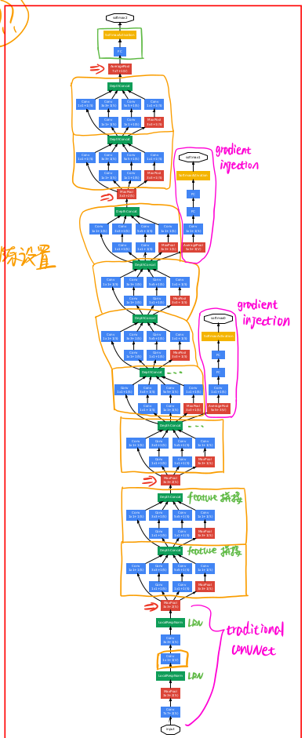

# [paper reading] GoogLeNet

|                    Topic                    |                      Motivation                       | Technique |         Key Element          |                     Use Yourself / Math                      |
| :-----------------------------------------: | :---------------------------------------------------: | :-------: | :--------------------------: | :----------------------------------------------------------: |
| [GoogLeNet](./[paper reading] GoogLeNet.md) | sparse structure & dense matrix problem to solve | Inception | Inception path 1x1 conv | Architecture data augmentation model ensemble Test Time Augmentation Inception |

## 基本概念

>   这个部分其实是最重要的！
>
>   建议先大概看看，然后通读全文，最后再回来看。这样一些东西就可以理解了。

### 结构的稀疏连接

#### **层间连接的稀疏结构** 

==> **spatial level**

**卷积层**可以实现**spatial level**的**稀疏结构**。

卷积层实现了层与层之间的**局部连接**（只对输入图像的某一部分patch进行卷积，而不是对整个图像进行卷积），从而实现了模型的**稀疏性**。

#### **特征连接的稀疏结构** 

==> **feature level**

**Inception module**可以实现**feature level**的**稀疏结构**。

在多个尺寸上进行卷积再聚合，把**相关性强的特征聚集**到一起，**每一种尺寸的卷积只输出256个特征中的一部分**，这也是种**稀疏连接**。

（此处没有说明 max pooling，但原理一样）

### 稀疏/密集分布的特征集

**稀疏分布的特征集**：**传统卷积层**

-   传统的卷积层的输入数据只和**一种尺度（比如3x3）**的卷积核进行卷积，输出固定维度（比如256个特征）的数据，所有256个输出特征基本上是均匀分布在 3x3 尺度范围上，这可以理解成输出了一个**稀疏分布的特征集**。

**密集分布的特征集**：**Inception**

-   inception模块在**多个尺度上**提取特征（比如1x1，3x3，5x5），输出的256个特征就不再是均匀分布，而是**相关性强的特征聚集在一起**（比如1x1的的96个特征聚集在一起，3x3的96个特征聚集在一起，5x5的64个特征聚集在一起），这可以理解成**多个密集分布的子特征集**。

>   关于**稀疏分布的理解**：只要**卷积层的输出特征**基本上是**均匀分布在某个尺度范围上**，则该输出特征就是稀疏分布的。这跟特征冗余与否没有什么关系，是两码事。

>   关于**密集分布的理解**：**每个子特征集都是密集分布**（因为通过聚类得到）。而不是多个子特征集放到一起才算密集。

## motivation

### problem to solve

#### sparse structure (of network)

早些的时候，为了打破网络对称性和提高学习能力，传统的网络都使用了随机稀疏连接。但是，计算机软硬件对非均匀稀疏数据的计算效率很差，所以在AlexNet中又重新启用了全连接层，目的是为了更好地优化并行运算。

这其实是我们不想看到的。我们希望能**保持网络结构的稀疏性**。

详见：[结构的稀疏连接](#结构的稀疏连接)

#### dense matrix (of features)

详见：[稀疏/密集分布的特征集](#稀疏/密集分布的特征集)

### sparse structure & dense matrix

即：**保持网络结构的稀疏性，又利用密集矩阵的高计算性能**

-   **网络的稀疏结构**，即我们希望模型是稀疏的。包括**层间的稀疏性**、**特征维度的稀疏性**。

    详见：[结构的稀疏连接](#结构的稀疏连接)。

-   **密集矩阵**，描述的是**feature map**，即我们希望 **feature map** 是**密集分布的特征集**。

    详见：[稀疏/密集分布的特征集](#稀疏/密集分布的特征集)

    **密集分布的特征集中**，**冗余**要少于稀疏分布的特征集，**运算效率**自然要更高。

## technique

### Inception

#### 目的

**通过构建密集的块结构来近似最优的稀疏结构**

-   这句话可能难以理解，为什么使用**密集的块结构**却依旧是**稀疏结构**？

    这是因为**密集的块结构**和**稀疏结构**的侧重角度不同。

    [结构的稀疏连接](#结构的稀疏连接)是一个更微观的角度。包括了**spatial level**的**层间的稀疏性**、**feature level**的**特征维度的稀疏性**。

    而**密集的块结构**要更宏观，而尽管layer level更密集，但其内部仍是上面提到的稀疏结构。

#### 贡献/作用

1.  **特征连接的稀疏结构** ==> **稀疏结构**

    **Inception module**可以实现**feature level**的**稀疏结构**。

    在多个尺寸上进行卷积再聚合，把**相关性强的特征聚集**到一起，**每一种尺寸的卷积只输出256个特征中的一部分**，这也是种**稀疏连接**。

    （此处没有说明 max pooling，但原理一样）

    

2.  **密集分布的子特征集** ==> **高运算效率**

    inception模块在**多个尺度上**提取特征（比如1x1，3x3，5x5），输出的256个特征就不再是均匀分布，而是**相关性强的特征聚集在一起**（比如1x1的的96个特征聚集在一起，3x3的96个特征聚集在一起，5x5的64个特征聚集在一起），这可以理解成**多个密集分布的子特征集**。

    >   传统的卷积层：输入数据只和**一种尺度（比如3x3）**的卷积核进行卷积，输出固定维度（比如256个特征）的数据，所有256个输出特征基本上是均匀分布在 3x3 尺度范围上，这可以理解成输出了一个**稀疏分布的特征集**。

    >   将稀疏矩阵分解成子密集矩阵来进行计算（示例）：
    >
    >   

    在Inception得到的**密集分布的特征集**，因为**相关性较强的特征聚集在一起**，**不相关的非关键特征就被弱化**，同样是输出256个特征，inception方法输出的特征“冗余”的信息较少。

    >   Hebbin赫布原理。
    >
    >   Hebbin原理是神经科学上的一个理论，解释了在学习的过程中脑中的神经元所发生的变化，用一句话概括就是 *fire togethter, wire together*。赫布认为“两个神经元或者神经元系统，如果总是同时兴奋，就会形成一种‘组合’，其中一个神经元的兴奋会促进另一个的兴奋”。
    >
    >   用在inception结构中就是要把相关性强的特征汇聚到一起。这有点类似上面的解释2，把1x1，3x3，5x5的特征分开。因为训练收敛的最终目的就是要提取出独立的特征，所以预先把相关性强的特征汇聚，就能起到加速收敛的作用。

3.  **多尺度信息**

    在直观感觉上在多个尺度上同时进行卷积，能提取到不同尺度的特征。特征更为丰富也意味着最后分类判断时更加准确。

## key elements

### Inception path

>   详见 [Inception](#Inception)

#### 特征连接的稀疏结构

**Inception module**可以实现**feature level**的**稀疏结构**。

在多个尺寸上进行卷积再聚合，把**相关性强的特征聚集**到一起，**每一种尺寸的卷积只输出256个特征中的一部分**，这是种**稀疏连接**。

#### 密集分布的子特征图

inception的不同支路在**多个尺度上**提取特征（比如1x1，3x3，5x5），输出的256个特征就不再是均匀分布，而是**相关性强的特征聚集在一起**（比如1x1的的96个特征聚集在一起，3x3的96个特征聚集在一起，5x5的64个特征聚集在一起），这可以理解成**多个密集分布的子特征集**。

#### 多尺度信息

在直观感觉上在多个尺度上同时进行卷积，能提取到不同尺度的特征。特征更为丰富也意味着最后分类判断时更加准确。

### 1x1 conv

对于某个像素点来说1x1卷积等效于该像素点在所有特征上进行一次全连接的计算。

>   1x1 卷积之后一定要接激活函数。因为无论是 1x1 卷积还是全连接层，都是线性变换，不接非线性激活函数就白搭！

#### channel维度的降维压缩

-   提高运算效率

    >   举一个具体的例子：
    >
    >   同样是输入一组有192个特征、32x32大小，输出256组特征的数据，传统CNN直接用3x3卷积实现，需要192x256x3x3x32x32=452984832次乘法；降维的Inception先用1x1的卷积降到96个特征，再用3x3卷积恢复出256组特征，需要192x96x1x1x32x32+96x256x3x3x32x32=245366784次乘法，使用1x1卷积降维的方法节省了一半的计算量。

-   维持了feature map在channel上的稳定

    因为Inception最后需要在channel维度上拼接，会导致channel维度的增加。

    与之对应必须有一个对应的降维操作，来维持channel维度的稳定。

    否则channel维度上一直往上涨，网络的深度就会受到限制。

    >   这和padding的思想类似，也是为了网络可以做得更深。

>   1x1 conv的使用位置
>
>   -   卷积层：conv之前。如此可使得后面的卷积层的参数矩阵维度降低，从而增加其参数矩阵的密集程度，提高计算效率。
>
>   -   最大池化层：pooling之后。（这里我觉得在pool之前或之后没有关系，因为池化层没有参数）

#### 提取更丰富特征

在相同尺寸的感受野中叠加更多的卷积，能提取到更丰富的特征。

>   这个观点来自于Network in Network (NIN, [https://arxiv.org/pdf/1312.4400.pdf](https://link.zhihu.com/?target=https%3A//arxiv.org/pdf/1312.4400.pdf))，图1里三个1x1卷积都起到了该作用。

-   增加 1x1 其实不影响后续卷积的感受野
-   非线性越多，提取到的特征越丰富 

## use yourself

### Architecture

除了较前层使用传统CNN结构外，之后的网络层都可以使用 Inception modul。

### data augmentation

-   multi scale/ratio

    多尺度，多长宽比的训练。

-   光学抖动。

    亲测有效，一种比较有效的数据增强方式。

### model ensemble

各模型相同处：

-   初始化
-   学习率

各模型不同处：

-   sampling methodology 
-   randomized input image order

### Test Time Augmentation

原论文采用的是一种相对激进的TTA方法，对一张图片提取了多达144个crops。

我们实际用的时候没必要这么激进！

144 crops  = 

-   1 **image** 
-   4 **scales** (256,288,320,352) 
-   3 **squares** (top, center, bottom / left, center, right) 
-   6 **crops** (center, 4 corner, itself) 
-   2 **mirror**

## blogs

-   [深入理解GoogLeNet结构（原创）](https://zhuanlan.zhihu.com/p/32702031)
-   [CNN经典模型之GoogLeNet](https://zhuanlan.zhihu.com/p/76446136)

## modifications

>   注意：还没真的读过论文！！！只是白嫖的知乎！！！

### Inception V2

#### motivation

在**不增加过多计算量**的同时，提高**网络的表达能力**。

>   只是单纯的堆叠网络虽然可以提高准确率，但是会导致计算效率有明显的下降。

#### technique

1.  **卷积分解（Factorizing Convolutions）**

    该方法可以在**保持感受野范围不变**的前提下，获得2个的优点

    -   减少**参数量**
    -   引入**更多的非线性**

    有2个实现方式：

    1.  **单个大卷积层 ==> 多个小卷积层**

        eg. 1个5x5 conv ==> 2个3x3 conv

        

        大量实验表明，这种替代并不会造成表达缺失。

    2.  **单个小卷积层 ==> 1xn & nx1 卷积层**

        eg. 1个3x3 conv ==> 1x3 conv & 3x1 conv

        

        

    将上面两点结合，大概就是这样的流程：

    

**后面的待续… …*