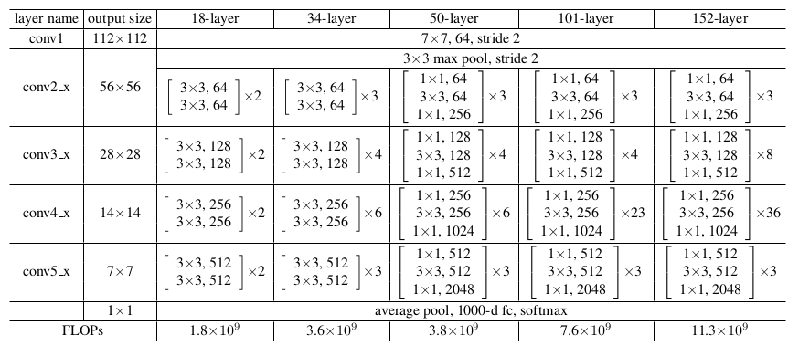
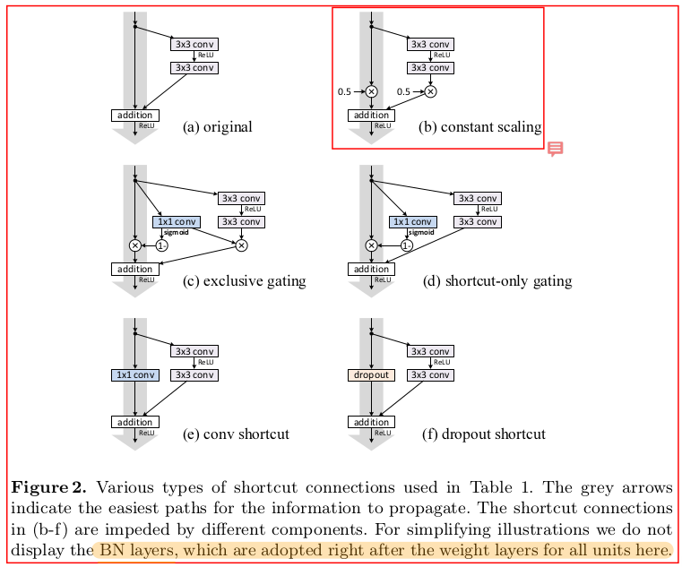

# [paper reading] ResNet

| topic  |                          motivation                          |                             math                             |                          technique                           |                         key element                          |                         use yourself                         |                 relativity                 |
| :----: | :----------------------------------------------------------: | :----------------------------------------------------------: | :----------------------------------------------------------: | :----------------------------------------------------------: | :----------------------------------------------------------: | :----------------------------------------: |
| ResNet | [problems to slove](#problems to slove) [identity mapping](#identity mapping) | [forward/backward propagation](#forward/backward propagation) [residual learning](#residual learning) | [residual learning](#residual learning) [residual block](#residual block) [ResNet Architecture](#ResNet Architecture) | [shortcut connection](#shortcut connection) [feature concatenate](#feature concatenate) | [ResNet Architecture](#ResNet Architecture) [residual block](#residual block) [shortcut connection](#shortcut connection) [ResNet V2](#ResNet V2) | [blogs](#blogs) [articles](#articles) |

## summary

给出4种理解ResNet的角度

-   **identity mapping**

    使网络更容易在某些层学到恒等变换（identity mapping）。在某些层执行恒等变换是一种构造性解，使更深的模型的性能至少不低于较浅的模型（性能的下界）。

    来自原作者 ResNet V1： [Deep Residual Learning for Image Recognition](https://arxiv.org/abs/1512.03385)

-   **ensemble-like behavior**

    残差网络是很多浅层网络的集成（ensemble），层数的指数级那么多。主要的实验证据是：把 ResNet 中的某些层直接删掉，模型的性能几乎不下降。 

    来自：[Residual Networks Behave Like Ensembles of Relatively Shallow Networks](https://link.zhihu.com/?target=http%3A//papers.nips.cc/paper/6556-residual-networks-behave-like-ensembles-of-relatively-shallow-networks) 

    **Implicit model ensemble** 的角度其实是 **identity mapping** 的延续和更深的解读。

-   **signal propagation**

    残差网络使信息更容易在各层之间流动，包括在前向传播时提供特征重用，在反向传播时缓解梯度信号消失。

    来自原作者 ResNet V2：[Identity Mappings in Deep Residual Networks](https://arxiv.org/abs/1603.05027)

-   **gradient correlation**

    resnet (+BN) 在保持**不同输入的梯度相关性**方面很优秀（相关性随深度 $L$ 的衰减从 $\frac{1}{2^L}$ 到了 $\frac{1}{\sqrt L}$ ）。使得网络避免了**深度网络下的白噪声梯度**，从而使得训练更稳定更容易。

    来自：[The Shattered Gradients Problem: If resnets are the answer, then what is the question?](https://arxiv.org/abs/1702.08591)

## motivation

### problems to slove

ResNet **主要解决了 degradation，捎带改善了 gradient vanishing**。

#### network degradation

-   **degradation的定义**

    简单来说，就是随着网络深度的增加，网络的性能不增反降，成为**网络的退化 (degradation)**。

    其中性能的下降不仅仅是在测试集，同样发生在训练集。

    

    这里需要强调的一点：**退化 (degradatoin)** $\not=$ **过拟合 (over fitting)** 

    -   **过拟合 (over fitting)** ：error在**训练集**下降，在测试集上升。

    -   **退化 (degradatoin)** ：error在**训练集**和测试集均下降。

-   **degradation的本质**

    深度网络**优化困难**

-   **degradation 的原因**

    -   **gradient vanishing**

        这个问题已经被超参数初始化和 Batch Normalization 解决得差不多了

        详见：[vanishing/exploding gradient](#vanishing/exploding gradient)

    -   **shattered gradient**

        来自：[The Shattered Gradients Problem: If resnets are the answer, then what is the question?](https://arxiv.org/abs/1702.08591)

        **神经网络越来越深**的时候，在**不同的数据**上反传回来的**梯度的相关性会越来越差**，最后接近**白噪声**。

        如果**mini-batch的梯度**接近**白噪声**，那梯度更新可能就是在做**随机扰动**，导致网络无法训练。

        详见：[Shattered Gradients (Gradient correlation)](#Shattered Gradients (Gradient correlation))

#### vanishing/exploding gradient

一般来说，因为超参数的设置，遇到的情况以 gradient vanishing 居多。

首先补习下正向传播和反向传播的推导：[forward & backward propagation](#forward & backward propagation)

可以看到，在反向传播中，参数矩阵 $W$ 和每层的激活值 $A$ 都会影响梯度的值。

-   **gradient vanishing 的定义**

    因为**反向传播算法的链式法则**，**梯度**会被表示为**后层梯度连乘**的形式。

    如果**每层计算的梯度值均小于1**，则在网络深度大的情况下，导致**前层的梯度**会**指数衰减**到很小的值，从而导致**参数几乎无法优化**。

-   **ResNet 之前解决 gradient vanishing 的方法**

    由于在反向传播中，参数矩阵 $W$ 和每层的激活值 $A$ 都会影响梯度的值，那么自然就可以在两个地方下手。

    >   Is learning better networks as easy as stacking more layers?
    >
    >   An obstacle to answering this question was the notorious problem of **vanishing/exploding gradients** [1, 9], which **hamper convergence from the beginning**. 
    >
    >   This problem, however, has been **largely addressed** by **normalized initialization** [23, 9, 37, 13] and **intermediate normalization layers** [16], which enable networks with tens of layers to start converging for stochastic gradient descent (SGD) with back-propagation [22].

    -   **normalized initialization**

        实话实说，现在来看用的似乎比较少了，因为（下面要提到的）Batch Normalization 会取代它的效果。

    -   **intermediate normalization layers**

        即：Batch Normalization 

        这个部分很重要，不在这里深究，会单独分出去讲。

### Relationship of degradation & gradient vanishing 

1.  **二者的由来**

    degradation 和 gradient vanishing 都是由**网络深度的增加**引起的。

2.  **二者的因果关系**

    **gradient vanishing 是 degradation 的原因之一**。

    -   网络的**退化**的问题是由网络**深度的增加**引起的，**梯度弥散**的仅仅是其的一个原因（不发生 gradient vanishing 是不发生 degradation 的**必要条件**）

        梯度弥散了，网络的优化就会失败。

    事实上，**尽管梯度不弥散，深度网络依旧是存在优化困难的**。

    >   所以网络上一些博客“解决梯度弥散 == 解决深度网络优化”是不正确的。

    这里我给出两个佐证：

    1.  论文中的叙述：

        >   Is learning better networks as easy as stacking more layers?
        >
        >   An obstacle to answering this question was the notorious problem of **vanishing/exploding gradients** [1, 9], which **hamper convergence from the beginning**. 
        >
        >   This problem, however, has been **largely addressed** by **normalized initialization** [23, 9, 37, 13] and **intermediate normalization layers** [16], which enable networks with tens of layers to start converging for stochastic gradient descent (SGD) with back-propagation [22].

        从现实来看，尽管**normalized initialization** 和 **intermediate normalization layers** 很大程度上解决了梯度弥散的问题，但网络依然会存在退化，依然存在优化困难。

    2.  **梯度相关性**：

        来自：[The Shattered Gradients Problem: If resnets are the answer, then what is the question?](https://arxiv.org/abs/1702.08591)

        >   We identify the **shattered gradient problem**: a previously unnoticed difficulty with gradients in deep rectifier networks that is **orthogonal to vanishing and exploding gradients**.

        即：**深度网络带来的梯度相关性的衰减**是“**正交**”于**梯度弥散/爆炸问题**的。

### identity mapping

>   这仅仅是 [summary](#summary) 中的第一种角度。因为是原作者的角度，所以把它放到了这里。

使**网络中的某些部分**可以更容易地被优化为**近似恒等映射**

-   令网络的某层直接学习**近似的恒等映射**（以维持网络的性能）是很难做到的。

    所以作者提出了 residual learning，使**得网络层可以更容易地学习到近似的 identity mapping**。

    >   it should be **easier for the solver** to find the **perturbations with reference to an identity mapping**, than to **learn the function as a new one**.

其实，**近似恒等映射 > 恒等映射**，因为恒等映射只能避免网络的退化，而不能进一步提高性能。

==> 其实**在恒等映射的基准上自由发挥才能获得更好的性能**。（类似的思路也体现在 **Batch Normalization** 中）

## technique

### residual learning

-   **idea**

    不令 stacked layers 的 $F(x)$ 直接去拟合恒等映射，而是令其**间接地去拟合恒等映射的残差**。

    原因：**相比去拟合恒等映射，堆叠的网络层更容易去拟合0**。

    >   Instead of hoping each **few stacked layers** directly fit a **desired underlying mapping**, we explicitly let these layers **fit a residual mapping**.

-   **purpose**

    即：**使stacked layers 要学习的 $F(x)$（而非 $H(x)$）更容易优化**

    -   优化的目标从 $\approx x $ 变成了 $\approx 0$

        从这个角度看，residual block 其实是曲线救国的思路。

        -   只要 $F(x)$ 能够更简单地训练成我们希望的样子，整个 block 的 $H(x)$ 满足要求就是自然而然的事情。

    -   **梯度相关性**的角度

        详见 [articles](#articles)

-   **essence**

    **给网络学习的目标定了一个基准（reference）**

    举个例子，让网络从0学习到1.1有点困难，但让网络从1学到1.1就要简单一点。

    同样的，对于网络的某部分（某些 stacked layers），把它**直接**优化到**近似恒等映射**在深度网络下很困难。而在**给出恒等映射（shortcut支路）**的情况下，再去学习到近似恒等映射就简单很多了。

    >   it should be **easier for the solver** to find the **perturbations with reference to an identity mapping**, than to **learn the function as a new one**.

    -   理论上来说，这个基准可以是任意的函数。

        只不过，这里的**基准选择为 identity mapping 是因为其有实际的物理意义**，即可将深度网络等效成较浅的网络。

-   **math**

    详见：[math](#math) 部分的 residual learning

### residual block

论文给出了 **residual learning 的最小单元**：**residual block**

-   浅层网络

    直接使用两个 3x3 conv 堆叠

-   深层网络 ==> **bottleneck**

    在保留一个 3x3 conv 的情况下，在之前和之后分别使用了1个 1x1 conv。

    其优点如下：

    -   极大地降低运算复杂度

        >   举个具体的例子：
        >
        >   我们来计算一下1*1卷积的计算量优势：首先看上图右边的bottleneck结构，对于256维的输入特征，参数数目：1x1x256x64+3x3x64x64+1x1x64x256=69632，如果同样的输入输出维度但不使用1x1卷积，而使用两个3x3卷积的话，参数数目为(3x3x256x256)x2=1179648。简单计算下就知道了，**使用了1x1卷积的bottleneck将计算量简化为原有的5.9%**，收益超高。

    -   引入了更多的非线性（更多的ReLU）

    -   对通道数进行降维和升维（跨通道信息整合）

    -   减少了感受野

        在深度网络中不建议使用过大的感受野。在深度网络的 residual block 通过 1x1 conv 减小感受野也是有好处的

    >   1x1 conv 和 3x3 conv 的size上的区别没关系，因为会采用 same padding 的方式维持相同的空间分辨率。

### ResNet Architecture

ResNet 的 Architecture 由三个部分构成

-   **输入部分**

    -   7x7 Conv, 64, s=2
    -   3x3 MaxPool, 64, s=2

-   **中间卷积部分**

    **网络之间的不同主要在于中间卷积部分的block参数和个数存在差异**。

    每个stage包括 Down Sampling 和 Residual Block 两个部分。

    Residual Block 根据网络的深度的分为 **一般的block** 和 **bottleneck block**，详见 [residual block](#residual block)

-   **输出部分**

    -   average pool
    -   1000-d fc
    -   softmax

## key element

### shortcut connection

shortcut connection 主要有两个作用

-   **identity mapping 的基准** ==> **forward propagation** ==> **network degradation**

    在此基础上，stacked layers 的 $F(x)$ 就只需要被优化为 $F(x)\approx 0$

    理论上来说，这个基准可以是任意的函数。

    只不过，这里的**基准选择为 identity mapping 是因为其有实际的物理意义**，可以将深度网络等效成较浅的网络。

-   **梯度的跳层回传** ==> **backward propagation** ==> **gradient vanishing**

    即：**深层的梯度可以被直接回传到较浅的层**。

### feature concatenate

来自 stacked layers 的feature和来自 shortcut connection 的feature，通过**相加**的方式实现聚合。（因为要以获得恒等映射为基准）

>   其实在 [DenseNet](https://arxiv.org/pdf/1608.06993.pdf) 中指出：**identity function** 和 **weight layers output** 以**求和的方式结合**，会**阻碍信息的传递**。
>
>   个人理解：在**channel维度上的拼接**更能保持**不同path信息的独立性**（而不会因为相加造成**特征混叠**的情况）

根据二者维度的相同与否，分为两种情况

-   **维度相同**
    $$
    \mathbf{y}=\mathcal{F}\left(\mathbf{x},\left\{W_{i}\right\}\right)+\mathbf{x}
    $$

    -   对应位置的元素直接相加
    -   不引入额外的参数和计算

-   **维度不同**

    -   zero entries padding

    -   projection
        $$
        \mathbf{y}=\mathcal{F}\left(\mathbf{x},\left\{W_{i}\right\}\right)+W_{s} \mathbf{x}
        $$
        $W_{s}$ ：linear projection

        仅仅使用 identity mapping 就足够解决degradation的问题，所以 $W_{s}$ 仅仅用来匹配维度。

## math

### forward/backward propagation

（推导来自吴恩达老师的视频）

首先放出一个结论：反向传播和正向传播的思路是类似的，主要差别在**计算方向**的不同。

在中间变量上：

-   正向传播：$z^{(l)}$ , $a^{(l)}$
    $$
    z^{(l)}_j = \sum_i w^{(l-1)}_{ji} · a^{(l-1)}_i
    $$

    -   $j$：神经元需要
    -   $l$：层数

    $$
    a^{(l)}_j = \sigma(z^{(l)}_j)
    $$

-   反向传播：$\delta^{(l)}$
    $$
    \delta_j^{(l)} = \sum_i w_{ij}^{(l)} · \delta_i^{(l+1)}
    $$

    -   $\delta^{(l)}_j$ 的含义：$a^{(l)}_j$ 的“error”

    -   $\delta^{(l)}_j$ 的数学含义：
        $$
        \delta^{(l)}_j = \frac{\partial}{\partial z_j^{(l)}} cost(i)
        $$
        其中：
        $$
        cost(i) = y^{(i)} \log h_w(x^{(i)}) + (1-y^{(i)}) \log h_w(x^{(i)})
        $$

        >   真正的cost为如下的形式：
        >   $$
        >   J(w) = -\frac1m\big[ \sum_{i=1}^{m} \big( y^{(i)} \log h_w(x^{(i)}) + (1-y^{(i)}) \log h_w(x^{(i)}) \big) \big]
        >   $$
        >   在仅考虑一个样本且忽略正则项下，就得到了上面的 $cost(i)$

指出一点，正向传播中用到的是 $W$，反向传播中是 $W^T$。这从$w$ 的角标就可看出。

### residual learning

整个 residual block 是由两部分组成的：

|   residual block    | $H(x)$ |
| :-----------------: | :----: |
|   stacked layers    | $F(x)$ |
| shortcut connection |  $x$   |

-   $H(x)$ ==> **identity mapping** ($\approx$)

    整个 residual block 的假设函数，反映了整个 residual block 的作用。

-   $F(x)$ ==> 0 ($\approx$)

    stacked layers 的假设函数，**stacked layers 需要拟合的 residual mapping**。

-   shortcut ==> $x$

    提供 identity mapping 的基准。

三者的关系：
$$
H(x) = F(x) + x
$$

#### address degradation

-   **identity mapping 角度**

    **使网络更容易在某些层学到恒等变换（identity mapping）。在某些层执行恒等变换是一种构造性解，使更深的模型的性能至少不低于较浅的模型。**

    因为 shortcut connection 给出了 residual mapping $F(x)$ 的 reference $x$

    我们需要 stacked layers 学习的 residual mapping $F(x)$ 就从近似的 $x$，变成了近似的0。
    $$
    F(x) = H(x) -x \approx0
    $$
    对应则有：
    $$
    H(x) = F(x) + x \approx x
    $$
    从而解决了 identity mapping 的问题。

#### address gradient vanishing

>   需要注意：上述公式仅仅是于 **Residual unit 内** skip connection（此处为shortcut）。
>
>   Residual unit 间 skip connection 在 ResNet V2 中推广，详见 [ResNet V2](#ResNet V2)

结论：**梯度可以通过shortcut connection直接回传到unit内的浅层**（V2中可以直接回传到整个网络的浅层）

在**一个 residual unit 内**，从浅层 $l$ 到深层 $L$ 的学习特征为
$$
x_{L}=x_{l}+\sum_{i=l}^{L-1} F\left(x_{i}, W_{i}\right)
$$
利用链式规则，可以求得反向过程的梯度：
$$
\frac{\partial \text {loss}}{\partial x_{l}}=\frac{\partial \text {loss}}{\partial x_{L}} \cdot \frac{\partial x_{L}}{\partial x_{l}}=\frac{\partial \operatorname{loss}}{\partial x_{L}} \cdot\left(1+\frac{\partial}{\partial x_{L}} \sum_{i=l}^{L-1} F\left(x_{i}, W_{i}\right)\right)
$$

-   第一项：$\frac{\partial \operatorname{loss}}{\partial x_{L}}$

    表示网络的 $L$ 层的梯度通过 shortcut 传播到 $l$ 层的梯度。

    >   需要注意：上述公式仅仅是于 Residual unit 内 skip connection（此处为shortcut）。
    >
    >   Residual unit 间 skip connection 在 ResNet V2 中推广，详见 [ResNet V2](#ResNet V2)

    这一项保证了当 $L$ 层经过 weight layers 传播到 $l$ 层的梯度很小的时候，$l$ 层的梯度依然可以通过 shortcut connection 来避免 gradient vanishing。

-   第二项：$\frac{\partial \operatorname{loss}}{\partial x_{L}} ·\frac{\partial}{\partial x_{L}} \sum_{i=l}^{L-1} F\left(x_{i}, W_{i}\right)$

    表示网络的 $L$ 层的梯度通过 shortcut 传播到 $l$ 层的梯度。

    只要 $\frac{\partial}{\partial x_{L}} \sum_{i=l}^{L-1} F\left(x_{i}, W_{i}\right)$ 不为 -1， 就不会发生 gradient vanishing

## use yourself

-   [ResNet Architecture](#ResNet Architecture)
-   [residual block](#residual block)

-   [shortcut connection](#shortcut connection)
-   pre-activation ==> [ResNet V2](#ResNet V2)

## articles

### ResNet V2

>   [Identity Mappings in Deep Residual Networks](https://arxiv.org/abs/1603.05027)

#### **ResNet V1 & ResNet V2 **

>   **ResNet V2 将 skip connection 的范围从 layer-level 推广到了 unit-level**。
>
>   **ResNet V2 才是完全版的 ResNet，ResNet V1 反而像是一个 prototype**。

具体来说，ResNet V2 和 ResNet V1 的主要区别主要在 skip connection 的范围：

-   ResNet V1 ==> **layer-level** 

    仅在同一个 residual unit 内的 Conv 能够 skip connection

-   ResNet V2 ==> **layer-level & unit-level**

    在保留了 **layer-level** 的 skip connection 下，将 skip connection 推广到了 **unit level**。

#### **modification**

>   ResNet V1 的基本公式
>
>   
>
>   -   $l$：residual unit 的编号（而非layer的编号）

#### **condition**

1.  **residual unit 内为 identity mapping** ==> **shortcut connection** 

    即： 
    $$
    h(x_l) = x_l
    $$

    >   实验证明，在 Residual unit 内的 skip connection 以 identity mapping 为最优（最快的误差衰减+最低的训练损失）
    >
    >   

2.  **residual unit 间为 identity mapping** ==> **after-addition activation**

    即调整 residual unit 的激活（BN和ReLU）的位置从 “original” 调整到 “proposed”

    公式见 **math**

    

#### **math**

-   **after-addition activation**

    主要是卷积、BN、激活这三者的位置发生了变化。

    公式表述为：
    $$
    f_{i}(x) \equiv W_{i} \cdot \sigma\left(B\left(W_{i}^{\prime} \cdot \sigma(B(x))\right)\right)
    $$
    这使得：
    $$
    \mathbf{x}_{l+1}=\mathbf{y}_{l}
    $$
    
-   **forward propagation**

    -   **相邻unit**

        ResNet V1 在**相邻residual unit** 的正向传播公式：
        $$
        \begin{array}{c}
        \mathbf{y}_{l}=h\left(\mathbf{x}_{l}\right)+\mathcal{F}\left(\mathbf{x}_{l}, \mathcal{W}_{l}\right) \\
        \mathbf{x}_{l+1}=f\left(\mathbf{y}_{l}\right)
        \end{array}
        \tag 2
        $$

        >   $l$：residual unit 的编号（而非layer的编号）
    
        在 Condition(2) 的 $\mathbf{x}_{l+1}=\mathbf{y}_{l}$ 下，我们得到在 **相邻residual unit**的正向传播公式：
    
    $$
    \mathbf{x}_{l+1}=\mathbf{x}_{l}+\mathcal{F}\left(\mathbf{x}_{l}, \mathcal{W}_{l}\right)
    $$
    
    -   **推广到任意unit**
    
        对于**任意 residual block**，对输入进行规定：**deeper unit 的 $\mathbf{x}_{L}$** 和 **shallower unit 的$\mathbf{x}_{l}$**
    
        则有：
        $$
        \mathbf{x}_{L}=\mathbf{x}_{l}+\sum_{i=l}^{L-1} \mathcal{F}\left(\mathbf{x}_{i}, \mathcal{W}_{i}\right)
        \tag{3}
        $$

-   **backward propagation**
    $$
    \frac{\partial \mathcal{E}}{\partial \mathbf{x}_{l}}=\frac{\partial \mathcal{E}}{\partial \mathbf{x}_{L}} \frac{\partial \mathbf{x}_{L}}{\partial \mathbf{x}_{l}}=\frac{\partial \mathcal{E}}{\partial \mathbf{x}_{L}}\left(1+\frac{\partial}{\partial \mathbf{x}_{l}} \sum_{i=l}^{L-1} \mathcal{F}\left(\mathbf{x}_{i}, \mathcal{W}_{i}\right)\right)
    \tag{4}
    $$

    -   第一项 $\frac{\partial \mathcal{E}}{\partial \mathbf{x}_{L}}$ ==> **信息的直接传递**

        确保**深层的信息**可以**直接**传递到**浅层** ==> **跨 residual unit 的直接传递**

        从而避免了梯度弥散（即便通过 weight layers 传递的梯度极端小）

    -   第二项 $\frac{\partial \mathcal{E}}{\partial \mathbf{x}_{L}} · \frac{\partial}{\partial \mathbf{x}_{l}} \sum_{i=l}^{L-1} \mathcal{F}\left(\mathbf{x}_{i}, \mathcal{W}_{i}\right)$ ==> **信息通过 weight layers 传递**

### Shattered Gradients (Gradient correlation)

>   [The Shattered Gradients Problem: If resnets are the answer, then what is the question?](https://arxiv.org/abs/1702.08591)

结论：

-   **ResNet 的引入可以保留 gradient 的 spatial structure，从而减慢 gradient correlation 的衰减，使得不同mini-batch的相关性更好，训练更稳定**。

#### 本质

Shattered Gradients 本质是：随着网络深度的加深，**梯度的 spatial structure 逐渐消失**。

>   The **shattered gradient problem** is that the **spatial structure of gradients** is progressively **obliterated** as neural nets deepen.

-   **spatial structure of gradient** 

    梯度的 **spatial structure** 指的是 **correlation structure**

    -   **correlation structure** ==> **correlations between gradients at different datapoints**

        即 **不同 (mini-batch) 输入数据产生的梯度的互相关性**，是 **data level / mini-batch level** 的概念

        论文的原句是：

        >   This paper presents a more detailed analysis that **considers correlations between gradients at different datapoints**.

        澄清一点：

        >   这里很容易被**误解**成 “**反向传播中前后层之间的梯度相关性**” 这种 **layer level** 的概念。
        >
        >   这种属于是从 **signal propagation** 的角度去理解了。
        >
        >   这不是该论文的角度。

#### 对训练的影响

**Shattered Gradients** 会导致 **不同 mini-batch 的梯度的互相关性** 衰减，并随着网络深度的加深逐渐衰减为**白噪声**。

>   论文中证明 plain network 的衰减速度为指数 ==> $\frac{1}{2^L}$

如果**mini-batch的梯度**接近**白噪声**，那梯度更新可能就是在做**随机扰动**，导致网络无法训练。

#### BN和ResNet的改进效果

>   建议去读论文，这里只是简要叙述

>   能把这张图看明白，我觉得论文的主要思想就抓住了！

-   **BN 提高了神经元的利用效率**

    表现为：在每个unit中，大概都有**一部分神经元被激活**（50%左右，如 **(b) 中 Blue Histogram** ）

    ==> 避免了 **(a) 中 Blue Histogram** 的**全激活/全不激活**的问题。

    **全激活/全不激活** 会使得神经元的利用效率很低：

    -   全激活：相当于激活函数ReLU没起作用，整个unit是完全线性的。
    -   全不激活：相当于这个unit不存在。

-   **ResNet 保护了 spatial structure，从而保护了 gradient correlation**

    -   如何理解 spatial structure

        **随着网络的训练，网络的各个层会起到相对固定的作用，产生相对固定的激活，但对于不同的输入产生的激活又不会完全一样**。

        **良好的 spatial structure**，反映在 contiguity 上，就是 c**ontiguity 需要覆盖较广的分布** (像 a b 的单峰都是典型的反例) 。

    可以看到 ResNet + BN 对应的 (c) 的 Green Histogram 上，为 contiguity 覆盖了较大的范围。

    >   Resnets maintain a **broad distribution of contiguity** even with deep networks whereas batch normalization on feedforward nets shatters these into small sections.

    **反映出 ResNet 的引入可以保留 spatial structure，从而减慢 gradient correlation 的衰减，使得不同mini-batch的相关性更好，训练更稳定。**

    具体来说，是**减慢到 $\frac{1}{\sqrt L}$ 的亚线性**。

    >   Theorem 3 shows that **correlations between gradients** decay **sublinearly with depth** $\frac{1}{\sqrt L}$ for **resnets** with **batch normalization**.

### Ensemble-like behavior

>   [Residual Networks Behave Like Ensembles of Relatively Shallow Networks](http://papers.nips.cc/paper/6556-residual-networks-behave-like-ensembles-of-relatively-shallow-networks) 

**ResNet 具有类似 ensemble 的行为**。

论文给出了3个结论：

-   ResNet 可以被视作**不同长度的Path的集合**（而不是一个极深的网络）

    

    公式表述为：
    $$
    \begin{aligned}
    y_{3} &=y_{2}+f_{3}\left(y_{2}\right) \\
    &=\left[y_{1}+f_{2}\left(y_{1}\right)\right]+f_{3}\left(y_{1}+f_{2}\left(y_{1}\right)\right) \\
    &=\left[y_{0}+f_{1}\left(y_{0}\right)+f_{2}\left(y_{0}+f_{1}\left(y_{0}\right)\right)\right]+f_{3}\left(y_{0}+f_{1}\left(y_{0}\right)+f_{2}\left(y_{0}+f_{1}\left(y_{0}\right)\right)\right)
    \end{aligned}
    $$
    **path 的长度服从二项分布**：
    $$
    P(X=k) = C_n^k ·p^k (1-p)^{n-k}
    $$
    

    **path 的总数为** $2^n$，其中 $n$ 是 Residual unit 的个数（即**有 $2^n$ 条路径能够连接到 output**）。

-   ResNet 具有**类似 ensemble 的行为**，网络的测试表现同 valid path 的数目具有平滑关系

    >   ResNet 的 ensemble-like behavior 并不属于严格的 ensemble

    -   **删掉单个module不会显著影响网络的性能** ==> **path之间没有强依赖**

        

        原因：删除一个module后，仍会有一半的path有效

        

    -   **删除或打乱多个module，性能出现平滑的变化** ==> **ensemble-like behavior**

        

-   **effective path 属于 short path**，并且在**训练时只有 effective path 对梯度有贡献**（训练时不需要 deep path）

    **不是所有的path都带有相同数量的梯度**

    但实际起作用的 path（**effective path**）比二项分布的期望**还要短**。

    

    >   **Deleting a module** from a residual network mainly **removes the long paths through the network**.
    >
    >   

### Hard For Identity Mapping

>   [MobileNetV2: Inverted Residuals and Linear Bottlenecks](https://arxiv.org/abs/1801.04381)
>
>   这篇论文还没有仔细看过，时间不够了。

深度的plain网络在恒等映射的困难体现在两个方面：

-   **网络优化困难**
-   **非线性激活带来逐层的信息损失**

本篇论文是从“第二点”的角度进行解释。

由于非线性激活函数Relu的存在，每次输入到输出的过程都几乎是不可逆的（**信息损失**）。我们很难从输出反推回完整的输入，即**带有非线性激活的网络层难以构成恒等映射**。

这张图是把一个低维的流形通过矩阵 $T$ 映射到高维空间，再进行ReLU非线性激活，最后通过 $T^{-1}$映射回低维空间。

可以看到经过ReLU非线性激活的流形跟原来的流形已经不一样了（无法实现恒等映射）。

-   n = 2, 3：information loss
-   n = 15~30：non-convex

## blogs

-   原作者的演讲：[CVPR2016 最佳论文 ResNet 现场演讲](https://zhuanlan.zhihu.com/p/54072011?utm_source=com.tencent.tim&utm_medium=social&utm_oi=41268663025664)

-   ResNet V1 & V2 的结构：[ResNet及其变种的结构梳理、有效性分析与代码解读](https://zhuanlan.zhihu.com/p/54289848)

-   [address gradient vanishing](#address gradient vanishing) 的参考：[你必须要知道CNN模型：ResNet](https://zhuanlan.zhihu.com/p/31852747)

-   梯度相关性的角度：https://www.zhihu.com/question/64494691/answer/220989469

    其实说的很不明不白的，容易引起歧义，还是看本文写的

-   ResNet的后续改进：[一文简述ResNet及其多种变体](https://zhuanlan.zhihu.com/p/35985680)

-   ResNet有效的多种理解角度：https://www.zhihu.com/question/52375139/answer/313397135

