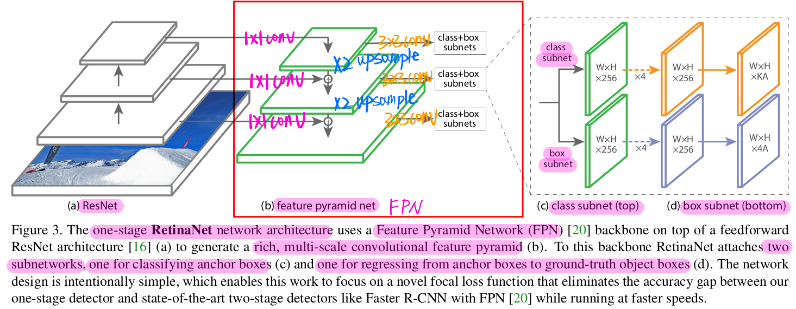
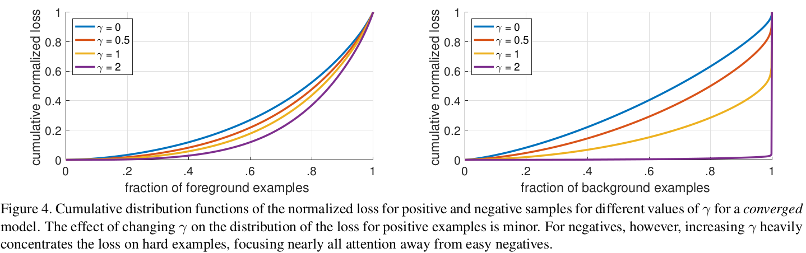

# [paper reading] RetinaNet

|   topic   |                          motivation                          |                       technique                        |                         key element                          |                             math                             |                         use yourself                         |                          relativity                          |
| :-------: | :----------------------------------------------------------: | :----------------------------------------------------: | :----------------------------------------------------------: | :----------------------------------------------------------: | :----------------------------------------------------------: | :----------------------------------------------------------: |
| RetinaNet | [Problem to Solve](#Problem to Solve) [Negative ==> Easy](#Negative ==> Easy) | [Focal Loss](#Focal Loss) [RetinaNet](#RetinaNet) | [Class Imbalance](#Class Imbalance) [Feature Pyramid Network](#Feature Pyramid Network) [ResNet-FPN Backbone](#ResNet-FPN Backbone) [Classify & Regress FCN](#Classify & Regress FCN) [Post Processing](#Post Processing) [Anchor Design](#Anchor Design) [Anchor & GT Matching](#Anchor & GT Matching) [prior $\pi$ Initialization](#prior $\pi$ Initialization) [Ablation Experiments](#Ablation Experiments) | [Cross Entropy Math](#Cross Entropy Math) [Focal Loss Math](#Focal Loss Math) | [Data Analysis](#Data Analysis) [Feature Pyramid Network](#Feature Pyramid Network) [More Scale $\not= $ Better](#More Scale $\not= $ Better) | [Related Work](#Related Work) [Related Articles](#Related Articles) [Blogs](#Blogs) |

## Motivation

### Problem to Solve

**one-stage**方法面对的**极端的正负样本不均衡**

### Negative ==> Easy

**正负样本不均衡**中的**减少负样本数量** ==> **降低负样本中简单样本的损失**（原因：负易样本占了全部样本的绝大多数）

-   **对数量巨大的easy negative的loss进行大幅度的衰减，从loss的角度就平衡了正负样本的比重**
-   **仅保留 hard positive 和 hard negative，其 learning signal 更有理由训练和优化**

>   注意：是**负样本中的简单样本**，而**不是全部的负样本**。因为one-stage的classification本质是一个多分类的问题，而background作为其中的一类，不能将其全部消除。

这是从 **one-stage detection** 的场景出发的

关于样本的分类，按照**正/负**和**难/易**可以分为下面四类：

|        |         难         |                   易                   |
| :----: | :----------------: | :------------------------------------: |
| **正** |   正难（**少**）   |           正易，$\gamma$衰减           |
| **负** | 负难，$\alpha$衰减 | 负易，$\alpha$，$\gamma$衰减（**多**） |

而 $\gamma$ 是指数衰减，$\alpha$ 是一次衰减，即$\gamma$衰减的效果要大于$\alpha$衰减。

也就是**模型的专注度**：**正难 > 负难 > 正易 > 负易**

## Technique

### Focal Loss

-   **Introduction**

    是对于**Cross Entropy Loss的dynamically scale**，对**well-classified的样本进行down-weight**，以处理**正负样本间的平衡**

    其核心思想是：**通过降低高置信度样本产生的损失，从而使模型更加专注于难分类 (即低置信度) 样本**。

-   **Essence**

    本质是对于**inliers (easy)** 的 down-weight

    >   而**robust loss function**是对于**outliers**进行down-weight（这里并不详细阐述）

-   **Result**

    使用**全部样本（不对样本进行采样）**下，使得**模型在稀疏的难样本上训练**（sparse set of hard example）
    
-   **Drawback**

    仅仅告诉模型**少去关注正确率的样本**，但**没有**告诉模型要**去保持这种正确率**

其数学推导详见 [Focal Loss Math](#Focal Loss Math)

### RetinaNet

由以下3个部分组成：

-   **[ResNet-FPN backbone](#ResNet-FPN backbone)**
-   **[Classification SunNetwork](#Classification SunNetwork)**
-   **[Regression SubNetwork](#Regression SubNetwork)**

## Key Element

### Class Imbalance

#### One-Stage

one-stage方法会**在训练时面临极端的foreground/background的类别不平衡**

从**数量**上讲：one-stage 会产生 **10k~100k** 个 candidate location，其中 **foreground: background $\approx$ 1: 1000**

#### Two-Stage

-   **stage-1** ==> **proposal**

    可以将 candidate local 降低到 **1~2k**（滤除了绝大部分的easy negative）

-   **biased minibatch sampling** ==> **fixed raios**

    对样本进行采样，使得 **foreground / background = 1: 3**（可以看做是**隐性的 $\alpha$-balancing**）

#### Results

fore/back的类别不平衡主要会产生2个问题：

-   **训练低效**

    占比极大的**easy negative**并**不贡献learning signal**

-   **模型退化**

    **easy negative**会**overwhelm训练过程**，导致**训练困难，造成网络退化**

### Feature Pyramid Network

>   [Feature Pyramid Networks for Object Detection](https://arxiv.org/abs/1612.03144)

**Feature Pyramid Network** 的目的是：使得**Feature Pyramid**在**所有高低分辨率（all scale）**上都有**强语义信息（strong semantic）**

#### Components

-   **bottom up（standard CNN）**
-   **top-down pathway**
-   **lateral connection**

    上图为FPN论文的框架（RetinaNet中只有取3个stage的feature map）

#### bottom up path

使用**CNN**进行特征提取，**空间分辨率逐渐下降，语义信息逐渐增强**

在bottom up path中**选取的feature map是每个stage中最后一层的输出**，具有**该stage中最强的语义信息**（输出feature map的size相同的层，统称为一个stage）

#### top-down pathway

对**最后一层的feature map**（具有**最强的语义信息**）进行**stride=2**的**上采样**，论文中的上采样方式为最简单的**最近邻**

#### lateral connection

横向连接为 $1×1 $ Conv，用于对 $\{C_2, C_3, C_4, C_5\}$ 的channel维度进行降维（论文中设定降维后的维度为 $d=256$）

>   注意：**merged feature map** 后面还需要进行 $3×3$ **Conv**，已降低**上采样带来的混叠现象**（**aliasing effect of upsampling**）

### **ResNet-FPN Backbone**

-   **ResNet**

    使用ResNet计算多个scale的feature map

-   **FPN**

    构成 feature pyramid

    >   详见 [Feature Pyramid Network](#Feature Pyramid Network)

### Classify & Regress FCN

#### Classification FCN

使用**FCN**，分别对**Feature Pyramid的不同层的feature map**进行**object的classification** 

##### Output

$W×H×KA$ 的vector

表示**每个spatial location的每个anchor**都有 $K$ 个**class**的**probability**

##### Components

-   4 个 $3×3$ Conv，$C$ filters（输出channel为 $C$）

    $C$ 为输入channel数（保持channel数不变）

    之后接 ReLU

-   1 个 $3×3$ Conv，$KA$ filters（输出channel为 $KA$）

-   **Sigmoid**

    输出每个spatial location（$W×H$）的 $A$ 个anchor的 $K$ 个类别的**probability**

>   **参数共享**：
>
>   **subnet的参数**在**所有的pyramid level**上**共享**

#### Regression FCN

使用**FCN**，分别对**Feature Pyramid的不同层的feature map**进行**bounding box的regression** 

##### Output

$W×H×4A$ 的vector

表示**每个spatial location的每个anchor**都有 $4$ 个 **bounding box regression**

##### Components

除了第5层卷积输出channel为 $4A$，其他与Classification FCN相同

### Post Processing

对**Feature Pyramid的每个level**的**prediction**进行**merge**，以0.5为阈值进行NMS

>   两个提速技巧：
>
>   -   **滤除**confidence＜0.5的box
>   -   在每个Feature Pyramid Level上，只对**1000个 top-scoring prediction**进行**decode**

### Anchor Design

#### scale & ratio

每个level的每个location，anchor选择3个scale，每个scale有3个ratios，共 **3×3 = 9 个anchor**

反应到原图上，可以覆盖**32~813**个pixel的范围

-   **ratios**

    1: 2、1: 1、2: 1

-   **scale**

    $2^0$、$2^{2/3}$、$2^{1/3}$

#### Ground Truth

每个anchor会带有2个向量

-   **classification**

    一个 $K$ 维的 one-hot vector，作为classification target（$K$ 为类别数）

-   **regression**

    一个 $4$ 维的vector，作为box regression target

### Anchor & GT Matching

根据**anchor与ground-truth box的IOU**进行匹配

-   **IoU > 0.5**

    **anchor被视为foreground**，被**分配到对应的ground-truth box**

    >   这会存在一个问题，即**ground-truth box有可能对应不到anchor**

-   **0.5 > IoU > 0.4**

    忽略该anchor

-   **IoU < 0.4**

    **anchor被视为background**

### prior $\pi$ Initialization

在**训练初期**，**频繁出现的类别会导致不稳定**

使用 “prior” 将**训练起始阶段**中 **rare class** 的 $p$ 设定为一个较低的值（比如0.01）

用于初始化**Classification SubNet**的**第5个卷积层（最后一个卷积层）**的 $b$
$$
b=-\text{log}((1-\pi)/\pi)
$$

### Ablation Experiments

#### RetinaNet $vs.$ SOTA

#### $\gamma$ on Pos & Neg Loss

即：**Focal loss** 对于**foreground的loss的衰减很小** (a)，但对于**background的loss衰减很大**，从而**避免了easy negative对于classification loss的overwhelming**

#### AP w.r.t $\alpha_t$

-   $\alpha_t=0.5$ 对应的结果最好
-   $\alpha_t$ 的值也会大幅度地影响AP

#### AP w.r.t $\gamma$

-   $\gamma=2$ 对应的结果最好
-   $\gamma$ 的值也会大幅度地影响AP

#### FL $vs.$ OHEM

-   FL性能明显优于OHEM

#### AP w.r.t scale & ratio

-   scale和ratio应该兼顾

-   一味地堆高scale会引起效果的下降

    原因可能是，这些scale本身不适合进行detection的任务

#### Perform w.r.t depth/scale

-   总体来说，depth和scale对performance均为正相关
    -   **depth越深**，**语义信息越丰富** ==> **对small object的提升最小**
    -   **scale越大**，**分辨率越高**，**位置和细节信息越丰富** ==> **对small object的提升最大**

## Math

### Cross Entropy Math

#### Standard Cross Entropy

-   **使用 $p$ 表示**
    $$
    \mathrm{CE}(p, y)=\left\{\begin{array}{ll}
    -\log (p) & \text { if } y=1 \\
    -\log (1-p) & \text { otherwise }
    \end{array}\right.
    $$
    

    -   $y \in \{-1, +1\}$：ground-truth的class
    -   $p \in \{ 0, 1\}$：预测类别为 $ 1$ 的预测概率

-   **使用 $p_t$ 表示**
    $$
    p_t=\left\{\begin{array}{ll}
    p& \text { if } y=1 \\
    1-p & \text { otherwise }
    \end{array}\right.
    $$
    
    $$
    \text{CE}(p,y) = \text{CE}(p_t) = -\text{log}(p_t)
    $$

>   **问题**：尽管每个easy sample的损失小，但大量的easy sample依旧会主导loss和gradient

#### Balanced Cross Entropy

$$
\text{CE}(p_t) = -\alpha_t \text{log}(p_t)
$$

-   $\alpha_t$：用于平衡正负样本

>   **问题**：仅仅是平衡正负样本，而不是难易样本，**治标不治本**

### Focal Loss Math

$$
\text{FL}(p_t) = -\alpha_t·(1-p_t)^{\gamma} ·\text{log}(p_t)
$$

-   **归一化系数**：

    **匹配到ground-truth**的**anchor**的数目

-   **使用位置**：

    **Classification SubNetwork** ==> 仅仅是分类任务的损失函数

-   $p_t$ ：被分类正确的概率。$p_t$ 越大，loss被down-weight的程度越大
-   $\gamma$ ：控制down-weight的程度
    -   实验中 $\gamma=2$ 最好
    -   $\gamma=0$ 时，FL Loss = CE Loss

>   求导：
>   $$
>   \frac{d\text{FL}}{d x}=y\left(1-p_{t}\right)^{\gamma}\left(\gamma p_{t} \log \left(p_{t}\right)+p_{t}-1\right)
>   $$

## Use Yourself

### Data Analysis

**数据分析能力**是至关重要的：“**做机器学习首先要是数据科学家**”

面对一项任务，**了解其数据的分布**是至关重要的一环，这会**建立起你对该任务面对的状况（尤其是困难）的直观的认识**

**良好的数据分布**会给后续的操作带来**良好的基础**，在一些方面也具有**优良的性质**

**Focal Loss**就是**数据分布上起作用**的

### [Feature Pyramid Network](#Feature Pyramid Network)

**Feature Pyramid Network** 其实是一种将**语义信息**和**细节/位置信息**结合的方式，处理了**feature map结合**时的**size不符**的问题，可以较好的**结合不同scale的feature map的优点**

**Feature Pyramid Network** 提取到的特征兼顾了**多种分辨率**和**强语义信息**，可以广泛地用于**后续的处理**（特征工程？）

**Feature Pyramid Network** 从**更广义**上来讲，其实是给出了一种**信息聚合的结构**，可以结合带有**不同属性**的**同种信息**

### More Scale $\not= $ Better

>   详见 [Perform w.r.t depth/scale](#Perform w.r.t depth/scale)

一味地增加**feature map的multi-scale**并**不是总能带来性能的提升**

**feature map的level的选取**，也需要**合理去选择**

**并不是拉过来一个feature map就能用！！！**

## Related Work

### Two-Stage Method

#### Characteristic

-   精度高，速度慢

#### Input

-   分类器的输入为**稀疏的候选目标集**（**sparse set of candidate object locations**）

#### Sampling Fashion

-   **stage-1** ==> **proposal stage**

    生成**稀疏的候选目标集**（**sparse set of candidate object locations**）

    **滤除**绝大部分的 **background samples**

-   **stage-2** ==> **classification stage**

    使用分类器进行分类，最终结果为 **foreground classes / background**

    在这阶段会采用 sampling heuristics，老保持foreground和background的平衡

    -   **fixed foreground-to-background ratio (1: 3)**
    -   **Hard Negative Mining** ==> **Online Hard Example Mining**

### One-Stage Method

#### Characteristic

-   速度高、精度略差

#### Input

-   对object的location、scale、ratio的 **regular & dense** 采样

    >   **regular, dense** sampling of object **locations, scales, and aspect ratios**

#### Sampling Fashion

对输入图片进行**网格式的密集采样**

>   fixed sample grid

## Related Articles

-   [Generalized Focal Loss](https://arxiv.org/pdf/2006.04388.pdf)

    对应博客：[大白话 Generalized Focal Loss](https://zhuanlan.zhihu.com/p/147691786)

-   [Gradient Harmonized Single-stage Detector](https://arxiv.org/abs/1811.05181)

## Blogs

-   样本不平衡、Focal Loss、GHM：[5分钟理解Focal Loss与GHM——解决样本不平衡利器](https://zhuanlan.zhihu.com/p/80594704)

-   GHM（待核对博客）：[AAAI 2019：把Cross Entropy梯度分布拉‘平’，就能轻松超越Focal Loss](https://zhuanlan.zhihu.com/p/55017036)

    

