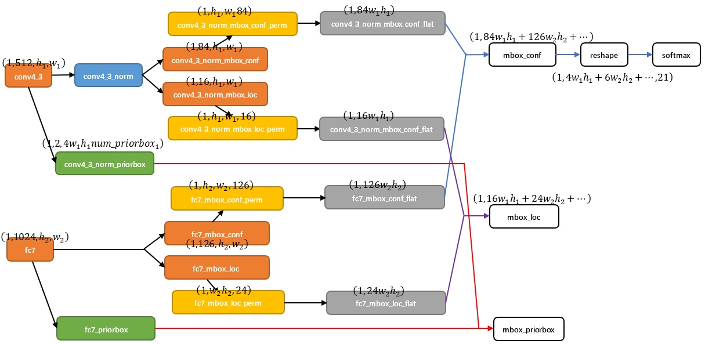

# [paper reading] SSD

| topic |                          motivation                          |                          technique                           |                         key element                          |                         use yourself                         |                             math                             |
| :---: | :----------------------------------------------------------: | :----------------------------------------------------------: | :----------------------------------------------------------: | :----------------------------------------------------------: | :----------------------------------------------------------: |
|  SSD  | [Problem to Solve](#Problem to Solve) [Contributions](#Contributions) | [SSD Architecture](#SSD Architecture) [Pros & Cons](#Pros & Cons) | [Higher Speed](#Higher Speed) [What Is Resample](#What Is Resample) [Low & High Level Feature](#Low & High Level Feature) [Small Object Difficulties](#Small Object Difficulties) [Data Flow](#Data Flow) [Anchor & GtBox Matching](#Anchor & GtBox Matching) [Foreground & Background](#Foreground & Background) [Hard Negative Mining](#Hard Negative Mining) [NMS](#NMS) [Data Augmentation](#Data Augmentation) [Testing (Inferencing) Step](#Testing (Inferencing) Step) [Performance Analysis](#Performance Analysis) [Model Analysis](#Model Analysis) | [Convolution For Speed](#Convolution For Speed) [Feature Pyramids Fashion](#Feature Pyramids Fashion) [Positive & Negative Imbalance](#Positive & Negative Imbalance) [Zoom In & Zoom Out](#Zoom In & Zoom Out) | [Loss Function](#Loss Function) [Multi-Level & Anchor](#Multi-Level & Anchor) [Layer Output & Filters](#Layer Output & Filters) [Model Output](#Model Output) |

## Motivation

### Problem to Solve

one-stage方法具有较高的测试速度，但准确率低

SSD在使用one-stage的框架下，提高了其准确率

one-stage方法准确率低的原因（YOLO）：

-   **对小目标检测乏力** 

    **feature pyramid第一层是backbone的输出，已经是低分辨率+强语义的feature map了**，**后续**基于此再产生的**feature pyramid分辨率会进一步下跌**

    导致**没有高分辨率的feature map用于检测小目标**（暂且不说语义的强弱）

    >   为解决这个问题，后续的 [RetinaNet](./[paper reading] RetinaNet.md) 从**low-level（high-resolution）的feature map上构建feature pyramid**，从而产生了**高分辨率+强语义的feature pyramid**

-   **会出现更多的Localization错误** ==> 重新使用**anchor**

### Contributions

1.  **SSD的表现**

    速度快于YOLO，精度逼平Faster-RCNN

2.  **SSD的核心**

    **使用卷积核 (层) 输出预测**

    通过在feature map上使用**small convolutional filter**，去预测**anchor**的**category score、box offset**

3.  **multi-scale和multi-ratio**

    -   multi-scale：不同scale的**feature map** ==> **Feature Pyramids Fashion**
    -   multi-ratios：不同ratio的**anchor** ==> **手工设计anchor的尺寸**

## Technique

### SSD Architecture

#### Framework Architecture

>   关于数据流，详见 [Data Flow](#Data Flow)

#### Modifications of Backbone

使用**VGG16**作为Backbone（属于隐性的grid划分）

>   之后的backbone多为ResNet了

其对于Backbone进行了以下的修改（主要分为2部分：**全连接层变为卷积层**、**dilation卷积**）

-   FC 6 ==> 3×3 Conv 6，dilation rate = 6

    

-   FC 7 ==> 1×1 Conv7

-   **conv4_3** 加 **L2 Normalization** 层

    该层特征图大小是 $38×38$，但是该层比较靠前，norm较大，所以在其后面增加了一个 **L2 Normalization** 层，以保证和后面的检测层差异不是很大

    **L2 Normalization** 仅仅是对**每个像素点**在**channle维度做归一化**

-   移除 dropout 层和 FC 8

-   Pool 5 ： $2×2-s2$ ==> $3×3-s1$

### Pros & Cons

#### Pros

>   详见 [Performance Analysis](#Performance Analysis)

-   **高正确率 + 高召回率**

    -   **confidence高的检测结果**都是大部分都是正确的

    -   **recall** 达到了85~90%

        >   **recall表示有多少目标被检测到**，一般以**IOU阈值**来判断（上图中实线为IOU>0.5，虚线为IOU>0.1）

-   **更少的 localization error**

    -   相比于two-stage：

        **直接回归**object的shape和category（而不是使用两个步骤）

    -   相比于one-stage：

        使用了精细设计的**anchor** / default box，为bounding box的scale和ratios提供了基准（相比于YOLOv1）

-   **在大目标上表现良好**

#### Cons

##### **小目标检测困难**

-   对于**不同的类别共享空间位置**（convolutional fashion）

-   **小目标**对于**bounding box的size十分敏感**（而小目标bbox对误差敏感）

-   **location和semantic难以兼顾**

    **SSD** 直接在**backbone的low-resolution+strong semantic的feature map**上构建**Feature Pyramid**，导致**整个Feature Pyramid都是low-resolution（缺少位置信息）**

##### default box 严重依赖手工设计

需要人工设置prior box的min_size，max_size和aspect_ratio值。

网络中prior  box的基础大小和形状不能直接通过学习获得，而是需要手工设置。

而网络中每一层feature使用的prior  box大小和形状恰好都不一样，导致调试过程非常依赖经验。

## Key Element

### Higher Speed

#### Structure

-   **相比于 Two-Stage**
    -   不使用**proposal**（RPN）
    -   不使用**resample**（ROI Pooling）

-   **相比于 One-Stage**

    ==> **全卷积网络** ==> **参数量**大大减少（而且GPU支持较好）

    -   **Backbone** 

        VGG的**FC层**都被换成了**Conv层**

    -   **Output**

        YOLO使用FC层计算输出，**SSD使用Conv层计算输出**

#### Input Image

==> **输入小图片** ==> **运算量**大幅减少

YOLO是448×448，而SSD是300×300 ==> 图片小了所需的运算就少了

### What Is Resample

resample其实是**根据proposal进行feature的重采样**，首先见于 Faster-RCNN

是在RPN获得proposal之后，返回去从feature map获取相应特征

这种方法**同时顾及了location和semantic**，在**小目标上检测良好**，但**模型复杂且费时间**

### Low & High Level Feature

>   **SSD**的**整个的Feature Pyramid都是high-level的feature map**（**Feature Pyramid中并不存在low-level的feature map**）
>
>   这一点需要**额外注意**

#### **low-level feature map**

优点：

-   保留有空间信息
-   细节信息丰富

缺点：

-   语义信息较少，**不适合直接用于后续操作**（比如分类）

    ==> 这导致**SSD**在检测**小目标上依旧乏力**（**虽然保留的位置信息，但是语义信息不够丰富**）

#### **high-level feature map**

优点：

-   语义信息丰富，一般**可直接用于后续操作**（比如分类）

缺点：

-   大幅度丢失了**位置**信息和**细节**信息

    丢失位置信息 ==> 定位不准

    丢失细节信息 ==> 小目标不易检测

>   Feature Pyramid Network 的架构可以产生**高分辨率、强语义的feature map**
>
>   详见 [RetinaNet](./[paper reading] RetinaNet.md)

### Small Object Difficulties

小目标检测是一个老大难的问题

**Faster-RCNN** 使用的**resample**的策略，**同时保证了location和semantic**，但是**模型复杂且时间消耗大**

**SSD** 作为**one-stage**方法，放弃了resample的策略，而是采用**多个level的feature map**，但是**由于feature map的选取问题，导致整个Feature Pyramid并没有包含low-level的feature map**（详见 [Low & High Level Feature](#Low & High Level Feature)）

### Data Flow

其**多level信息的聚合**是发生在**输出阶段**（不是像DenseNet发生在feature map阶段）

### Anchor & GtBox Matching

**ground-truth box** 和 **anchor** 的匹配关系是**一对多**的关系，即：**一个ground-truth至少会匹配到一个anchor**

>   相比于ground-truth & anchor 1对1的匹配，一对多这样的目的有两个：
>
>   -   尽可能**提高recall**
>   -   一定程度上**增加正样本数量**，缓解正负样本的不平衡

其匹配准则有两个：

-   **Max IOU** ：

    **ground-truth box**会与**最大IOU的anchor**匹配 ==> 保证**1对1匹配**

-   **Threshold IOU**：

    **ground-truth box**会与 **IOU超过Threshold（0.5）的anchor**匹配 

### Foreground & Background

Background作为Foreground类别之一

这会导致**分类任务**中极端的**正负样本不平衡**，SSD 使用 [Hard Negative Mining](#Hard Negative Mining) 缓解这个问题

>   Faster-RCNN 先区分Background和Foreground（region proposal），之后再foreground分类
>
>   YOLOv1通过confidence区分background和foreground（$\text{confidence} = \text{Pr}(\text{object})*\text{IOU}_{pred}^{truth}$），同时对才foreground进行分类。最后使用confidence矫正foreground的分类结果（滤除 **False Negative**）

### Hard Negative Mining

目的：**维持正/负样本（foreground/background）正常的比例**

对**负样本**的 **confidence loss 降序排列**，取 **confidence loss 最高的负样本**（即 **Hard Negative**）

换句话说，是**抛弃了容易分类的background**，以**避免其overwhelming分类的loss**

>   后续的 **Focal Loss** 以一种更优雅、更灵活的方法解决了这个问题

### NMS

**NMS** 作为**得到bounding box和score**之后的 **post-processing**

详见 [YOLO v1](./[paper reading] YOLO v1.md)

### Data Augmentation

>   detection中常用的有以下几种：
>
>   -   水平翻转（horizontal flip）
>   -   随机裁剪（random crop）
>   -   颜色扭曲（color distortion）
>   -   随机采集块域（Randomly sample a patch）==> 获取小目标训练样本 

#### **随机裁剪 random crop**

-   整个的原始输入图像
-   与object的IOU为 $[0.1, 0.3, 0.5, 0.7, 0.9]$ 的patch
-   随机采样patch

>   采样patch的尺寸为原图的 $[0.1, 1]$，aspect ratios 为 $\frac12, 2$

#### **水平翻转 horizontal flip**

对每个采样到的patch：

1.  首先resize到固定尺寸
2.  以0.5的概率水平翻转

#### **颜色扭曲 color distortion**

>   [Some Improvements on Deep Convolutional Neural Network Based Image Classification](https://arxiv.org/abs/1312.5402)

#### Zoom In & Zoom Out

-   **Zoom in** (Random Crop) ==> **large object**

    >   The **random crops** generated by the strategy can be thought of as a ”**zoom in**” operation and can **generate many larger training examples**.

-   **Zoom out** ==> **small object**

    1.  将原图像放在 $16×$ 的画布的随机位置
    2.  其他位置使用均值填充
    3.  random crop

    

    **Zoom Out** 产生大量小目标，对**提高小目标检测性能**有显著提升：

    

    其原因是**小目标数量少**，导致**小目标对应的anchor难以训练**（类似于分类时正负**样本不平衡**对正样本训练的影响）

    而 **Zoom Out** 的方法产生了**大量的小样本**，提升了小样本在数据集中的比重，从而**提高了小样本的检测性能**：

    >   Data augmentation，翻来覆去的randomly crop，保证每一个prior box都获得充分训练而已

### Testing (Inferencing) Step

-   对于每个预测框，首先根据类别置信度确定其类别（置信度最大者）与置信度值
-   过滤掉属于背景的预测框
-   然后根据置信度阈值（如0.5）过滤掉阈值较低的预测框
-   对于留下的预测框进行解码，根据先验框得到其真实的位置参数（解码后一般还需要做clip，防止预测框位置超出图片）
-   根据置信度进行降序排列，然后仅保留top-k（如400）个预测框
-   NMS算法，过滤掉那些重叠度较大的预测框

最后剩余的预测框就是检测结果了。

### Performance Analysis

#### Recall & Error Type

#### Bbox Size & Ratios

### Model Analysis

-   **数据增强**可以大幅度提高mAP

-   **box的形状**越多越好

    

-   **多个不同空间分辨率的输出**显著提高性能

    

## Use Yourself

### Convolution For Speed

理论上卷积层的输出结果可以替代全连接层，但卷积层的运算量和参数量相比于全连接层少很多

小改动有大收益

实际上**网络中可以不再出现全连接层**

### Feature Pyramids Fashion

检测任务天然会面对multi-scale和multi-ratios的困难

使用多个level的feature map是解决multi-scale方法的直觉思路

但单独使用每个level的feature map都会有不足

如何整合多了level的feature map是一个重要的问题

### Positive & Negative Imbalance

正负样本不平衡的产生原因是：将background作为foreground的一个类

这会导致分类的损失函数被负样本主导（因为缺少了two-stage方法在stage-1对负样本的过滤）

其解决方法大概有3个：

-   Hard Negative Mining
-   Focal Loss
-   Online Hard Example Mining

### Zoom In & Zoom Out

zoom in / zoom out 可扩增大目标 / 小目标的数量

尤其是 zoom out，可以获得大量的小样本，在一定程度上结局了小目标的anchor的训练难题

这对于小目标的增益十分明显

## Math

### Loss Function

$$
L(x, c, l, g)=\frac{1}{N}\left(L_{\operatorname{conf}}(x, c)+\alpha L_{\operatorname{loc}}(x, l, g)\right)
$$

-   $N$：匹配到ground-truth box的anchor数目

-   $x_{ij}^p={1,0}$：表示第 $i$ 个anchor是否匹配到类别为 $p$ 的第 $j$ 个ground-truth box

    当 $x_{ij}^p=1$ 时，表示第 $i$ 个anchor匹配到第 $j$ 个ground-truth box，ground-truth类别为 $p$

这依旧是一个 **Multi-Task** 的损失函数：

-   **Confidence Loss**：
    $$
    \frac{1}{N} L_{\operatorname{conf}}(x, c)
    $$
    $L_{\operatorname{conf}}(x, c)$ ：
    $$
    L_{\text {conf}}(x, c)=-\sum_{i \in \text {Pos}}^{N} x_{i j}^{p} \log \left(\hat{c}_{i}^{p}\right)-\sum_{i \in \text {Neg}} \log \left(\hat{c}_{i}^{0}\right) \quad \text { where } \quad \hat{c}_{i}^{p}=\frac{\exp \left(c_{i}^{p}\right)}{\sum_{p} \exp \left(c_{i}^{p}\right)}
    $$

-   **Location Loss**：
    $$
    \frac{1}{N} L_{\operatorname{loc}}(x, l, g)
    $$
    $L_{\operatorname{loc}}(x, l, g)$ ：

    **predicted box** ($l$) 和 **ground-truth box** (g) 的 **Smooth L1** 损失：
    $$
    L_{l o c}(x, l, g)=\sum_{i \in P o s}^{N} \sum_{m \in\{c x, c y, w, h\}} x_{i j}^{k} \operatorname{smooth}_{\mathrm{Ll}}\left(l_{i}^{m}-\hat{g}_{j}^{m}\right)
    $$

    $$
    \operatorname{smooth}_{L_{1}}(x)=\left\{\begin{array}{ll}
    0.5 x^{2} & \text { if }|x|<1 \\
    |x|-0.5 & \text { otherwise }
    \end{array}\right.
    $$

    注意：**Location Loss** 仅仅对 **positive anchor**（匹配到ground-truth box的anchor）进行计算

    **回归公式**为：

    -   中心点坐标 $cx, cy$ ==> **平移**
        $$
        \begin{aligned}
        \hat{g}_{j}^{c x}=\left(g_{j}^{c x}-d_{i}^{c x}\right) / d_{i}^{w}  \\
        \hat{g}_{j}^{c y}=\left(g_{j}^{c y}-d_{i}^{c y}\right) / d_{i}^{h} \\
        \end{aligned}
        $$
    
-   宽和高 $w,h$ ==> **缩放**
        $$
        \begin{aligned}
        \hat{g}_{j}^{w}=\log \left(\frac{g_{j}^{w}}{d_{i}^{w}}\right) &\\
        \hat{g}_{j}^{h}=\log \left(\frac{g_{j}^{h}}{d_{i}^{h}}\right)
        \end{aligned}
        $$

### Multi-Level & Anchor

#### Feature Map

>   注意：

即：在**多个scale的feature map**，使用**多个ratios的anchor**进行**detection**

卷积层index和feature map的size如下：

|      index       |  Conv4_3  |   Conv7    |  Conv8_2  | Conv9_2 | Conv10_2 | Conv11_2 |
| :--------------: | :-------: | :--------: | :-------: | :-----: | :------: | :------: |
| feature map size | 38×38×512 | 19×19×1024 | 10×10×512 | 5×5×256 | 3×3×256  | 1×1×256  |

#### Anchor Scale

anchor的相对于每层feature map size的尺度 $s_k$ 由下式计算：
$$
s_{k}=s_{\min }+\frac{s_{\max }-s_{\min }}{m-1}(k-1), \quad k \in[1,m]
$$

-   $s_k$：anchor的相对于feature map的size的比例
-   $s_{\min }$：0.2
-   $s_{\max }$：0.9
-   $m$：所使用feature map的个数，此处为6

经计算，anchor占对应feature map的scale以0.17递增，即：

| index |    Conv4_3     | Conv7 | Conv8_2 | Conv9_2 | Conv10_2 | Conv11_2 |
| :---: | :------------: | :---: | :-----: | :-----: | :------: | :------: |
| scale | 单独设定为0.10 | 0.20  |  0.37   |  0.54   |   0.71   |   0.88   |

反映在原图上的true size为（输入图片为300×300）：

|   index   | Conv4_3 | Conv7 | Conv8_2 | Conv9_2 | Conv10_2 | Conv11_2 |
| :-------: | :-----: | :---: | :-----: | :-----: | :------: | :------: |
| true size |   30    |  60   |   111   |   162   |   213    |   264    |

#### Anchor Ratios

对每层feature map的ratios有4个或者6个

-   6 ratios

    $a_r = [1,1',2,\frac12, 3,\frac13]$

-   4 ratios

    $a_r = [1,1',2,\frac12]$

其长宽 $w, h$ 为：
$$
w_k^a = s_k \sqrt {a_r}
$$

$$
h_k^a = \frac{s_k}{\sqrt {a_r}}
$$

### Layer Output & Filters

相比于YOLO使用 FC层输出结果，SSD使用了convolutional filter来输出结果，从而获得更少的参数、更快的速度

SSD是一个全卷积网络，用于detection的feature map通过convolutional filter来输出结果

每个filter只输出一个值，这个值是category score，或是box offset

对于feature map的每个location，输出维度为：
$$
(c+4)*k
$$

-   $c$：目标的类别数+1（background与foreground一起做分类）

    >   没有了YOLO的confidence区分正负样本，这会导致正负样本极端的不平衡，SSD使用了[Hard Negative Mining](#Hard Negative Mining)来维持正负样本的比例

-   $4$：bounding box的4个offset

-   $k$：feature map每个location的anchor数，为6或4

对于一个 $m×n$ 的feature map，其输出维度为：
$$
(c+4)*k * m *n
$$
所需filter的个数也是：
$$
(c+4)*k * m *n
$$
以 $5×5$ 的feature map为例，其输出为：

### Model Output

|      index       |                 Conv4_3                 |                  Conv7                  |                 Conv8_2                 |               Conv9_2               |              Conv10_2               |              Conv11_2               |
| :--------------: | :-------------------------------------: | :-------------------------------------: | :-------------------------------------: | :---------------------------------: | :---------------------------------: | :---------------------------------: |
| feature map size |                38×38×512                |               19×19×1024                |                10×10×512                |               5×5×256               |               3×3×256               |               1×1×256               |
|      scale       |             单独设定为0.10              |                  0.20                   |                  0.37                   |                0.54                 |                0.71                 |                0.88                 |
|    true size     |                   30                    |                   60                    |                   111                   |                 162                 |                 213                 |                 264                 |
|      ratios      |           $[1,1',2,\frac12]$            |      $[1,1',2,\frac12, 3,\frac13]$      |      $[1,1',2,\frac12, 3,\frac13]$      |    $[1,1',2,\frac12, 3,\frac13]$    |         $[1,1',2,\frac12]$          |         $[1,1',2,\frac12]$          |
|      output      | (1, 4×4, 38, 38) (1, 4×21, 38, 38) | (1, 6×4, 19, 19) (1, 6×21, 19, 19) | (1, 6×4, 10, 10) (1, 6×21, 10, 10) | (1, 6×4, 5, 5) (1, 6×21, 5, 5) | (1, 6×4, 3, 3) (1, 6×21, 3, 3) | (1, 4×4, 1, 1) (1, 4×21, 1, 1) |

anchor的中心点坐标为：
$$
\big(  \frac{i+0.5}{|f_k|} ,\frac{j+0.5}{|f_k|}\big)
$$

-   $|f_k|$ 为第 $k$ 层feature map的size

最终输出为：

-   **location**：(1, 8732, 4)
-   **confidence**：(1, 8732, 4)

>   其中 **8732** 为输出总的bounding box数目，为 $(4×38×38)+(6×19×19)+(6×10×10)+(6×5×5)+(4×3×3)+(4×1×1)$
>
>   所以说**SSD本质上是密集采样**

>   关于数据流，详见 [Data FLow](# Data FLow)

## Blogs

-   [目标检测|SSD原理与实现](https://zhuanlan.zhihu.com/p/33544892)：细节信息比较丰富，网络魔改的结构，有TensorFlow代码

-   [一文理解SSD到底是如何检测目标的](https://zhuanlan.zhihu.com/p/94663367)：对比试验和损失函数

-   [目标检测——SSD简介及代码注释（附github代码——已跑通）](https://zhuanlan.zhihu.com/p/70415140)：网络的输出维度

-   [目标检测算法之SSD代码解析(万字长文超详细)](https://zhuanlan.zhihu.com/p/95032060)：PyTorch代码讲解

    >   [【目标检测实战】Pytorch—SSD模型训练（VOC数据集）](https://zhuanlan.zhihu.com/p/92154612)：配置教程

-   [SSD目标检测](https://zhuanlan.zhihu.com/p/31427288)：数据流、优缺点分析、一些trick及其作用

-   [为什么SSD(Single Shot MultiBox Detector)对小目标的检测效果不好？](https://www.zhihu.com/question/49455386/answer/135983998)
-   [目标检测算法之SSD的数据增强策略](https://zhuanlan.zhihu.com/p/96949881)：数据增强代码

